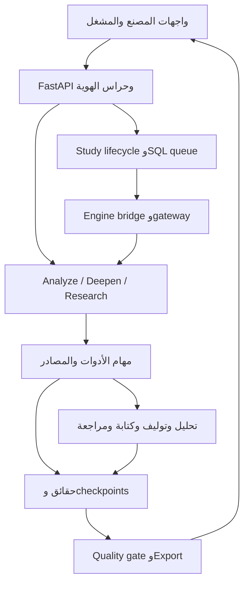
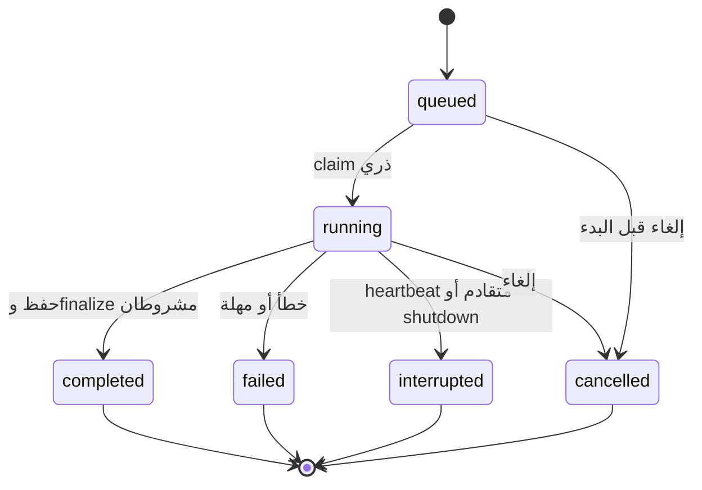

# SILK — FULL REPOSITORY FORENSIC AUDIT

**Commit audited:** `8143125ea37660986d616007ca1df355ad332b80` · **Branch:** `main` · **Report:** `SILK_FULL_FORENSIC_AUDIT_20260908.md`

**وقت تجميع التقرير UTC:** 2026-09-07T22:41:30+00:00. التاريخ في اسم الملف هو التاريخ المطلوب من المالك، 2026-09-08. أوقات الأدلة الأصلية محفوظة كما سُجلت؛ خط الأساس وقراءات GitHub/الأسعار في 2026-09-07 UTC، وبعض XML يسجل المنطقة `+05:00`. لا نغيّر timestamps لتوافق اسم الملف.

**نوع العمل:** AUDIT فقط. لم تُعدّل شيفرة المنصة أو مخطط بيانات المستخدم، ولم تُنفذ دراسة مدفوعة أو نشر أو commit أو تغيير إعداد GitHub/Railway. أضيف هذا التقرير وأدلته فقط. روابط الشيفرة مثبتة على SHA أعلاه، لا على فرع متحرك.

## 1. Executive Summary

**المنصة ليست مؤهلة بعد لاعتماد واسع أو لضمان صحة دراسات كثيرة متزامنة.** لديها أساس اعتمادية حقيقي: طابور SQLite دائم، claims ومعاملات لحماية تشغيل دراسة المنصة، run tokens، heartbeat، إلغاء، استئناف، حراس للتصدير، وCI واسع. لكن توجد عيوب مؤكدة في حدود أدوات AI وميزانياتها، وفصل الحقيقة عن الادعاء، وهوية الاستئناف، وتحديث النتائج المشتقة، وحسابات تجارية ذات وحدات غير متوافقة. هذه أخطاء correctness تسبق زيادة العمال أو شراء موارد أكبر.

الحصيلة **25 finding: صفر P0 مثبت، 11 P1، و13 P2، و1 P3**. توجد **23 حالة أعيد إنتاجها محلياً**، ونتيجة لحماية الفرع من GitHub، ونتيجة معمارية ساكنة. العدد ليس مؤشراً إحصائياً لنسبة العيوب في المشروع.

| الدليل المنفذ | النتيجة | ماذا يثبت فعلاً |
|---|---|---|
| حزمة `tests/` كاملة في بيئة معزولة | 4822 passed؛ 0 failed؛ 63 skipped؛ 0 xfailed؛ 238.63s | العقود والسيناريوهات التي تغطيها الاختبارات؛ لا يثبت خدمات AI الحية |
| حزمة خادم حقيقي محددة | 21 passed؛ 0 failed/skipped/xfail؛ 184.40s | uvicorn/SQLite/HTTP، restart/cancel/export والـbridge مع مزودين محاكيين |
| قراءات HTTP مستقلة | 37/37 أعادت 200 | startup/readiness/config/markets والصفحات والأصول و26 ملف WOFF2 |
| migrations على قواعد جديدة | 21 للمنصة +5 للمتجر؛ الإعادة 0 | إنشاء مخططات نظيفة وidempotent؛ لا يثبت مطابقة DB الإنتاج |
| طابور حقيقي بعمل محاكى | 1/10/50/100/500/1000 مهمة؛ peak workers≤3؛ no duplicates؛ integrity=ok | dispatch/claim/finish على SQLite تحت الحمل المحاكى فقط |
| Ruff syntax + JS syntax | 0 diagnostics؛ 5 وحدات JS سليمة نحوياً | أسماء/نحو للقواعد المختارة؛ ليس type checking كاملاً |
| CI على SHA نفسه | CI + E2E/PDF + Docker ناجحة | دليل GitHub مستقل عن التشغيل المحلي، وخطواته محفوظة |

أكثر المخاطر إلحاحاً: 001/002 حدود الأداة والميزانية، 003/004 صدق التقرير وحالة مراجعته، 007/013 إعادة استخدام أدلة قديمة، 011/016/018 صحة الحسابات، 025 تكرار إنشاء البحث، و015 منع وصول الانحدار إلى main. لا يوجد إثبات لفاتورة مكررة أو اختراق tenants أو فساد قاعدة إنتاجية في هذه الجلسة.

**القدرة عند 1000 دراسة AI فعلية متزامنة غير مختبرة.** التجربة قدمت 1000 وظيفة اصطناعية إلى سقف 3 عمال. كذلك لا نستطيع نسب مبلغ فاتورة Railway إلى كود بعينه دون metrics وفاتورة وإعدادات النشر الفعلية. النموذج العددي في القسمين 17 و18 تقدير مشروط معلن.

## 2. Audit Scope

شمل الحصر جميع **752 ملفاً متتبعاً**، وتصنيفها وحجمها، ومراجعة مسارات التشغيل الحرجة، وواجهات API البالغ تعريفها المزخرف **99**، و174 وحدة Python غير اختبارية تضم **76,672 سطراً**، وملفات الواجهة الستة وJavaScript، وجميع 26 migration و5 workflows وDocker/Railway والاعتماديات المباشرة.

الحصر الكامل قابل للمراجعة في [repository-map.csv](sandbox:/workspace/scratch/2ad45e935a38/silk-556/audit/20260908/repository-map.csv)، وتفصيل الرموز في [inventory.json](sandbox:/workspace/scratch/2ad45e935a38/silk-556/audit/20260908/inventory.json)، ونقاط API في [api-endpoints.csv](sandbox:/workspace/scratch/2ad45e935a38/silk-556/audit/20260908/api-endpoints.csv). تعريف endpoint هنا هو `@app.method`/تعريف route مقروء؛ يشمل `/_test/slow` المشروط بصمام اختبار يرفض الإقلاع عند تفعيله في production، ولا يشمل auto-generated OpenAPI/docs أو static mounts. خانة guards في CSV ترصد استدعاءات مباشرة؛ غيابها لا يعني غياب حماية middleware/helper.

منهج الإثبات: static code review → تعقب المستدعين والحراس → شاهد معزول للحالة المشكوك فيها → مقارنة مع اختبارات المشروع → تقدير أثر بشروط معلنة. فُحصت الاختبارات كلها بالتشغيل، لكن مراجعة جودة assertions كانت موجهة للمسارات الحرجة، لا ادعاء مراجعة بشرية مستقلة لكل assertion من آلافها. لم تُعتبر وثائق الحوادث السابقة إثباتاً لتكرارها على HEAD الحالي.

| السطح | تغطية هذا التدقيق | الحد المتبقي |
|---|---|---|
| Backend/Engine/Agents/Writer/HS | كود، callers، witnesses، suite | نتائج مزود حي وبيانات تجارية حقيقية لم تُسحب |
| DB/migrations | كل SQL بالترتيب + قواعد جديدة/إعادة تطبيق/قيود | DB الإنتاج، حجمها، أيتامها وmigration drift الفعلي غير متاحة |
| Security | auth/tenant/service flows، اختبارات وحراس، static candidates، CI secrets/deps | ليس pentest حيّاً ولا شهادة خلو كامل التاريخ من الأسرار |
| Frontend/landing/RTL | مصادر Git، hooks/assets، HTTP، اختبارات قائمة | المتصفح المحلي منع loopback بـ`ERR_BLOCKED_BY_CLIENT`؛ visual/keyboard/console حيّ جديد لم يكتمل |
| CI/CD | جميع workflows + خطوات successful على SHA | protection/rulesets إضافية مقيدة بالخطة؛ مسار Railway dashboard غير متاح |
| Cost/scalability | قيود التنفيذ + queue probe + نموذج مفصول الافتراضات | لا قياس RSS/token/CPU لدراسة AI كاملة، ولا invoices/replicas/rate-tier حية |
| Git history | HEAD والالتزام السابق في shallow clone، وCI secret-scan | المسح المحلي الكامل لكل تاريخ Git لم يُنفّذ؛ نجاح job لا يثبت نطاق جميع التاريخ |

لم يُثبت أو يُرقَّ عشرات الأدوات، ولم تُنفذ upgrades عمياء. لم تُستخدم حسابات إنتاج أو قاعدة مستخدم. شواهد الفشل تقطع HTTP الخارجي وتحاكي المصدر؛ فحص HTTP المحلي يشغّل خادماً يملكه التدقيق ويوقفه بعد الاختبار.

## 3. Repository Baseline

| بند | قيمة مثبتة قبل إنشاء التقرير |
|---|---|
| الجذر الصحيح | `/workspace/scratch/2ad45e935a38/silk-556` |
| فرع المستخدم | `main` |
| HEAD | `8143125ea37660986d616007ca1df355ad332b80` |
| Remote | `origin` → `https://github.com/hadadi2/556.git` |
| Git status / modified / untracked | نظيف؛ لا ملفات معدلة أو غير متتبعة عند baseline |
| مساحة التدقيق | worktree منفصل detached على SHA نفسه: `/workspace/scratch/2cce15180231/silk-audit-8143125` |
| التاريخ المحلي المتاح | shallow clone؛ التزامان ظاهرَان؛ لا نستنتج أنهما كل التاريخ |
| آخر commit | `8143125` — Integrate approved Silk interfaces and research animation (#2)، 2026-09-07T23:03:08+03:00 |
| السابق | `e991175` — Preserve factory HS input and restore secret-scan CI (#1)، 2026-09-07T17:40:31+03:00 |
| ملفات متتبعة/حجم العمل المتتبع | 752 / 19,036,919 bytes ≈18.16MiB؛ لا يشمل pack history أو dependencies المحلية |
| Runtime نشر/CI | Python 3.11؛ uvicorn/FastAPI؛ Docker `python:3.11-slim` |
| Runtime التدقيق | Python 3.12.13؛ الاعتماديات المباشرة مطابقة للمثبتات؛ فرق runtime معلن |
| Frontend | HTML/CSS/JavaScript ثابتة، بلا React hydration أو npm app build |
| Package managers | pip؛ npm لأدوات Playwright في CI؛ apt لمكتبات النظام/الخطوط/LibreOffice |
| Dependency files | `requirements.txt`, `requirements-ci.txt`, `requirements-dev.txt`, `requirements-nightly.txt` |
| Lock state | direct pins موجودة؛ لا lock متعدٍّ شامل مع hashes؛ لا package-lock لتطبيق واجهة |
| Environment/config | `.env.example`، `config/branding.yaml`، `config/pricing.yaml`، وقراءات SILK_* في المصدر |
| Deploy/build | `Dockerfile`, `.dockerignore`, `docker/entrypoint.sh`, `docker/fonts.sha256`, `railway.json`, `.github/workflows/*.yml` |

تفاصيل أوامر root/branch/SHA/remotes/status/log وقائمة الملفات محفوظة في [repository-baseline.json](sandbox:/workspace/scratch/2ad45e935a38/silk-556/audit/20260908/repository-baseline.json). لم نستعمل reset/clean/force-push أو حذف branch أو overwrite لتعديلات المستخدم. التقرير يبقى إضافة غير ملتزمة ليُراجع على baseline محدد.

## 4. Architecture Map

| المجال | المصدر الفعلي | حدود ومسؤوليات |
|---|---|---|
| Operator Backend/API | `api.py` | analyze/deepen/research، config/markets، HS، history/status، export/diagnostics؛ مفتاح خدمة للحساس |
| Factory/Admin API | `silk_platform/api.py` | حسابات/session، roles/tenant، كتالوج، studies/quota، wallets/ledger، notifications، uploads |
| Platform domain | `silk_platform/{repository,models,quota,auth,db,engine_bridge,study_runtime}.py` | scope الحساب، claim وإطلاق/إغلاق وتشخيص run |
| Study engine | `silk_engine.py`, `silk_research_pipeline.py`, `silk_research_runtime.py`, `silk_research_gateway.py` | quick/deep، بوابات، orchestration، callbacks، recovery |
| AI | `silk_missions.py`, `silk_llm_runtime.py`, `silk_llm_provider.py`, `silk_ai_judge.py`, `silk_market_analyst.py` | مهام الأدوات، بروتوكول المزود، الكاتب/المراجع/المحلل |
| HS | `silk_hs_{norm,resolver,confirm,pipeline,classifier,attributes,dialog,from_image,reference}.py` | lexical/reference/LLM proposals + validation + human confirmation |
| Market ranking/economics | `silk_market_ranker.py`, `silk_research.py`, `silk_economics.py`, `silk_decision.py`, `silk_deep_pillars.py` | مؤشرات وترتيب/تقاطعات/اقتصاد بطاقة المنتج |
| Buyer discovery | `silk_discovery.py`, importers/channels/competitors/maps/explee/volza modules | كيان مستشهد به، لا مشترٍ مؤهل تلقائياً؛ outreach القديم غير مسار حي |
| Data/store/cache | `silk_data_layer.py`, `silk_data_layer_v2.py`, `silk_store.py`, `silk_storage.py`, `silk_cache.py`, `silk_sqlite.py` | HTTP/throttle/cache + مخازن SQLite متعددة |
| Reports/quality | `silk_reports.py`, `silk_render.py`, `silk_quality_gate.py`, `silk_export_gate.py`, PDF/textlayer modules | view/Markdown/DOCX/PDF، قيود أدلة/بنية/اتجاه العربية |
| Web | `web/index.html`, `platform.html`, `platform-landing.html`, `pricing.html`, `checkout.html`, `reset-password.html`, `marketing.js` | لوحة مشغل، مصنع/Admin، landing، pricing وauth flows |
| AuthZ/AuthN | `silk_platform/auth.py`, passwords/repository، حراس `api.py` | Factory/Admin منفصلان عن مفاتيح operator/owner |
| Jobs/queue/scheduler | `study_runtime`, `research_runtime`, janitor/maintenance helpers | SQL queue + threads في عملية API، supervisor/reaper؛ لا Redis/Celery broker |
| Notifications | platform notification modules، SMTP/watchdog alerts عند ضبطها | حفظ بعد الحالة وإرسال حسب الإعداد؛ لم يُرسل شيء في التدقيق |
| Observability | `silk_trace.py`, `silk_context.py`, `silk_diagnostics.py`, `silk_ops_log.py`, `silk_watchdog.py`, `silk_pricing.py` | run/trace/events/usage/quality؛ ليست منصة metrics موزعة كاملة |
| DB migrations | `migrations/001…005`, `migrations/platform/001…021` | متجر مرجعي/قديم ومنصة؛ مخزن التحليل/usage لهما DDL داخل Python |
| Tests/scripts | `tests/`، `tools/`، `fix_agent.py` | hermetic/rungs/evals/smoke/import/fixtures؛ dev agent منفصل عن المنتج |
| Delivery | Docker/Railway + 5 workflows | CI موجود، production overrides غير متحقق منها |



| Documented architecture | Actual runtime architecture | النتيجة |
|---|---|---|
| 12 agents في العرض | 12 مهمة ضمن LLMMissionAgent، ثم محلل وتوليف وكاتب ومراجع؛ وهناك 24 class بيانات/بحث أخرى في المسارات الأخرى | رقم 12 لا يساوي كل نداءات AI أو threads |
| «Unified store» في بعض النصوص القديمة | platform.db + silk.db + silk_store.db + usage.db وغيرها؛ `silk_storage` ما زال مسار التحليل الحي | لا معاملة واحدة تشمل جميع المخازن |
| «مهلة الكاتب 300s» | streaming idle=120s وtotal=900s افتراضياً؛ continuations قد تتبع | لا تحسب latency من تعليق قديم |
| «سقف 40/100» | فحص runtime مرن؛ دفعة أدوات تتجاوزه؛ الكاتب وذيوله ليست كلها محكومة بحاجز عدّ واحد | 002؛ مطلوب budget فعلي |
| «كل رقم مؤصل» | IDs موجودة لكن raw numeric entailment غير مفروض على claim | 003/009/016/018 |
| «مراجعة قبل النجاح» | reviewer None يضيع في عقد النتيجة | 004 |
| «أخضر CI مطلوب» | jobs موجودة وخضراء، main غير protected في القراءة الحالية | 015 |
| tracing «عند التفعيل» وjanitor «off» في بعض docstrings | deep_research الكامل يفعّل trace؛ cache retention=30 يوماً، traces=0 دون config | 024؛ الوثيقة لا تعوض قراءة الفرع الفعلي |

## 5. Runtime/Data Flow

**Factory launch:** زر التشغيل في `web/platform.html` → `POST /platform/studies/{id}/launch` → session/Factory/ownership/validation/readiness → claim quota وحالة study وrun_token وإنشاء study_runs(queued) داخل معاملة → dispatcher يعدّ الجاري في DB ويحجز حتى 3 → thread في engine_bridge → quick analyze أو deep gateway → تخصيص analysis_id وربطه بالـstudy → milestones/checkpoints → حفظ النتيجة → finalizer مشروط بالـstate/token → commit ثم إشعار → polling يُظهر الحالة والنتيجة.

**Root research:** `POST /research` → service-key/rate/HS/readiness/ack gates → admission خاص بهذه الواجهة → حجز USD وanalysis row (أو CAS resume) → synchronous pipeline أو background thread/202 → أول 11 مهمة بالتوازي → opportunity_gaps اعتماداً عليها → augment/recovery حيث موصول → analyst → deep pillars/threads/synthesis → writer/reviewer → quality metadata/view/save → history/status/export. ترتيب تفاصيل التعزيز يتبع مواضع `run_all_missions` ولا يعني أنه 12 API requests فقط. تشغيل `resume` يحتاج معالجة 007/013؛ الإنشاء الجديد يحتاج 025.

**Analyze/ranking:** `/analyze` → HS product contract → source policy → `silk_engine.analyze`/ranker → مرشحو أسواق من المرجع/Comtrade → جمع الدول حتى 16 thread → أوزان ومقاييس → enrich للصفوف المختارة؛ حزمة البحث الثمانية قد تعمل لثلاثة أسواق بالتوازي → deterministic decision/AI extras عند إتاحتها → view/persist. `ResearchManager` الأساسي يتتابع، لكن ranking وmarket research ليسا sequential بالكامل.

**Deepen:** طلب صريح مستقل → auth/rate/validation/reservation/paid context → المصادر المدفوعة المختارة LocalPrice/Volza/Explee وغيرها → نتائج موسومة + إعادة حساب/عرض → ledger/usage. غياب المفتاح يرجع gap، لا أرقام مصطنعة. لم يجر تفعيل هذه المصادر في التدقيق.

**HS/image:** نص أو صورة → intake/normalization → resolver وcandidate/reference checks → ambiguity/numeric attributes → اقتراح LLM عند السماح → إعادة تحقق schema/reference → confidence/status → confirmation → حفظ HS/source/provenance → run gates. تفاصيل 021 في القسم 13.

**Export:** analysis_id مخول → saved view/deep_research → evidence/quality/export policy → Markdown/DOCX → عند PDF: LibreOffice محدود إلى تحويلين متزامنين افتراضياً، process group timeout، فحوص glyph/brackets/RTL → artifact. أسماء الملف والمحتوى تخضع للتعقيم؛ رأينا HTTP/DOCX وقرائن CI PDF، لا ادعاء فتح كل تصدير إنتاجي.

**Authentication:** login → rate/brute-force checks → bcrypt/session token محمي → account/role resolving → cookie/API checks → repository owner scope. مفاتيح operator/owner ليست cookies المصنع؛ دراسة من حساب لا تُمنح تلقائياً لحساب آخر. اختبارات authz تساعد الإثبات، لكنها لا تغني عن اختبار كامل Matrix الهويات عند الإصلاح.

**API contract review:** حُصرت definitions الـ99 في CSV، وراجعت عائلاتها حسب الحدود التالية:

| Endpoint family | Auth/validation/error/pagination | ملاحظة عقد |
|---|---|---|
| health/ready/config/index/markets/resolve/sources | قراءات عامة مقصودة؛ rate limits حيث موصولة، health مستقل للاستجابة السريعة | لا تفترض أن كل public route يجب أن يحمل service key؛ readiness الإنتاج تحتاج قياس effective config |
| products/intake وclassify_hs | service key +validated input +rate/gates؛ 422 للمدخل غير المحسوم | مرشح HS ليس نتيجة معتمدة؛021 |
| analyze/deepen/research/discover/trend | models/guards؛ 401/403 للهوية،422/409 للرفض،429 للميزانية/الضغط،202 للبحث async | إنشاء research لا يدعم idempotency025، والاستئناف يحتاج013 |
| root settings/diagnostics/ops/backup/watchdog | مفتاح خدمة/owner guard حسب العملية، allowlisted store names | لا تكشف قيم الأسرار في config/report؛ حراس owner-specific لازمة للتجاوزات |
| analyses/list/detail/brief/export/regenerate/leads/ask/outcome | service key؛ limits للقائمة؛404 للسجل المفقود؛export gate وPDF slots | response view/report contract محفوظ؛ regeneration يتأثر بـ004/005/007/010 |
| platform auth/me/language/password/reset | session/role، throttle، request fields، token lifecycle | language snapshot لا يتغير بheader منتصف الدراسة في tests |
| platform products/studies/launch/cancel/complete/archive/reports | owner scope عبر helpers حتى حين لا يظهر guard مباشر في CSV؛ transitions/quota | نفس المعرف محمي من duplicate launch؛025 يخص root POST جديداً |
| platform images/signed-url/files | owner/signed URL، حجم/type/signature/path validation | `/files/{storage_key}` يقرأ توقيعاً scoped، وليس static directory مكشوفاً للحسابات |
| wallet/ledger/audit/notifications/entitlements | account-scoped؛ pagination/limits حسب route، mark-read يخص المالك | ledger ليس usage AI؛ لا تربطهما بحساب تقديري واحد |
| admin metrics/fund/accounts/studies/tiers/quota/reset/unlock/deactivate/diagnostics | `_require` role=admin، validation وthrottle للعمل المكلف | الاختبارات الحالية لا تعفي كل تغيير من role×method matrix |
| analyst/aggregates | role-specific aggregate path | لا مساواة aggregate بالمستند الكامل لكل مصنع |
| public pricing/checkout/reset pages | قراءة/إرسال نية checkout مع throttle/dedupe | payment provider غير مهيأ صراحةً؛ لا ادعاء الدفع الناجح في UI |

الـAPI غير versioned بمسار `/v1`، وتستعمل وظائف كثيرة قواميس مرنة مع Pydantic للمدخلات بدلاً من response_model صارم شامل. بعض exceptions الداخلية تضاف إلى run_error/diagnostics المخولة؛ يجب أن يبقى النص للعميل مصنفاً وتعقيمه عند إضافة provider جديد. لا توجد pagination موحدة لكل عائلة؛ القوائم المهمة تحمل bounds لكن قياس أحجام responses مع DB إنتاج كبيرة pending. حد request العام والرفع/الـPDF منفصلان؛ HTML ثابت لا يحدد صلاحية تشغيل أو نجاح محاسبي. لم يثبت browser/API broken call جديد خارج findings المذكورة.

## 6. Findings Summary

`F01` في ملف الشواهد يقابل `SILK-AUDIT-001`، وهكذا. `015` دليل GitHub و`023` دليل Static/AST؛ بقية 23 finding لها شاهد. assertions فيها تثبت سلوكاً معيباً حالياً، ولذلك **نجاح شاهد الخطأ ليس نجاح regression إصلاحه**. يلزم قلب التوقع للسلوك الصحيح في اختبارات الإصلاح.

| ID | Severity | النتيجة | نوع الدليل |
|---|---|---|---|
| SILK-AUDIT-001 | P1 | قائمة أدوات المهمة لا تُفرض عند التنفيذ | إعادة إنتاج محلية |
| SILK-AUDIT-002 | P1 | ميزانية الأدوات تُفحص قبل الجولة ويمكن تجاوزها داخل الدفعة | إعادة إنتاج محلية |
| SILK-AUDIT-003 | P1 | صحة معرف الاستشهاد لا تمنع اختلاق الرقم المنسوب إليه | إعادة إنتاج محلية |
| SILK-AUDIT-004 | P1 | تعذر المراجع يُختزل إلى غياب اعتراضات | إعادة إنتاج محلية |
| SILK-AUDIT-005 | P2 | إعادة الكتابة الجزئية تفقد وسم عدم الاكتمال | إعادة إنتاج محلية |
| SILK-AUDIT-006 | P2 | إعدادات لوحة الكاتب والمراجع لا تتحكم في التنفيذ المعلن | إعادة إنتاج محلية |
| SILK-AUDIT-007 | P1 | الاستئناف يعيد استخدام مراحل مشتقة من أدلة تغيّرت | إعادة إنتاج محلية |
| SILK-AUDIT-008 | P2 | المهلة لا تمنع تعزيزاً متأخراً من تعديل التقرير المشترك | إعادة إنتاج محلية |
| SILK-AUDIT-009 | P2 | إعادة تغليف حقائق المحلل تسقط بيانات المصدر والوحدة | إعادة إنتاج محلية |
| SILK-AUDIT-010 | P2 | انقطاع بث النموذج قبل رسالة النهاية لا يسجل كخطأ | إعادة إنتاج محلية |
| SILK-AUDIT-011 | P1 | مقارنة الأسعار تجمع عملات وأحجام عبوات مختلفة | إعادة إنتاج محلية |
| SILK-AUDIT-012 | P2 | دالة توصية كامنة تحوّل الرسوم والشحن المجهولين إلى صفر | إعادة إنتاج محلية |
| SILK-AUDIT-013 | P1 | الاستئناف يسمح بتغيير المنتج وHS مع أدلة الدراسة القديمة | إعادة إنتاج محلية |
| SILK-AUDIT-014 | P2 | تقييم الجودة لا يطابق عقد التقرير أو حالة المهمة | إعادة إنتاج محلية |
| SILK-AUDIT-015 | P1 | نجاح CI لا تفرضه حماية main الحالية | GitHub حي |
| SILK-AUDIT-016 | P1 | اختيار أول قيمة من Eurostat قد ينسب مجموعة فرعية إلى الإجمالي | إعادة إنتاج محلية |
| SILK-AUDIT-017 | P2 | مقارنة Trends بين استعلامات مطبعة منفصلة ليست مقارنة حجم طلب | إعادة إنتاج محلية |
| SILK-AUDIT-018 | P1 | حساب SOM يفترض أن السعة الشهرية بالكيلوغرام | إعادة إنتاج محلية |
| SILK-AUDIT-019 | P2 | الإلغاء المتأخر لا يُفحص قبل إنهاء نتيجة جوهرية بالنجاح | إعادة إنتاج محلية |
| SILK-AUDIT-020 | P2 | سعر Sonnet 5 في تقدير الكلفة أعلى من السعر الرسمي الحالي | إعادة إنتاج محلية |
| SILK-AUDIT-021 | P2 | التأكيد اليدوي يتجاوز صلاحية رمز HS الأساسية | إعادة إنتاج محلية |
| SILK-AUDIT-022 | P2 | اتصال مخزن التحليلات لا يفعّل القيد الأجنبي المعلن | إعادة إنتاج محلية |
| SILK-AUDIT-023 | P3 | وحدات مركزية كبيرة وشبكة اعتماد كثيفة تصعّبان عزل التغيير | Static/AST |
| SILK-AUDIT-024 | P2 | آثار البحث الكاملة تُحفظ افتراضياً بلا نافذة احتفاظ | إعادة إنتاج محلية |
| SILK-AUDIT-025 | P1 | تكرار إنشاء البحث لا يملك عقد idempotency يمنع تشغيل دراسة ثانية | إعادة إنتاج محلية |

## 7. P0 Findings

لم تثبت نتيجة P0 ضمن الأدلة المتاحة. هذا ليس شهادة بعدم وجودها في الإنتاج؛ لا نملك قواعد الإنتاج أو فواتيره أو إعدادات Railway الحية. لا تُرقّى المخاوف النظرية إلى فساد بيانات أو double billing مثبت.

## 8. P1 Findings

### SILK-AUDIT-001 — قائمة أدوات المهمة لا تُفرض عند التنفيذ

**ID:** SILK-AUDIT-001

**Severity:** P1

**Component:** AI runtime / tool authorization

**File:** [silk_llm_runtime.py](https://github.com/hadadi2/556/blob/8143125ea37660986d616007ca1df355ad332b80/silk_llm_runtime.py#L734), [silk_llm_runtime.py](https://github.com/hadadi2/556/blob/8143125ea37660986d616007ca1df355ad332b80/silk_llm_runtime.py#L1143), [silk_llm_runtime.py](https://github.com/hadadi2/556/blob/8143125ea37660986d616007ca1df355ad332b80/silk_llm_runtime.py#L1310)

**Lines / Symbol:** `silk_llm_runtime.py:734` — `_execute_tool`; `silk_llm_runtime.py:1143` — `_run_loop: offered tools`; `silk_llm_runtime.py:1310` — `tool_use dispatch`

**Evidence:** Direct reproduction F01: مهمة trade_flow تسمح بـcomtrade_imports فقط. أرجع النموذج المحاكى web_search فنُفّذت مرة واحدة. العرض على النموذج مقيّد، لكن البحث في TOOLS عند التنفيذ عام.

**Reproduction:** شغّل reproduce_findings.py؛ proof_tools يحقن tool_use مسجلاً خارج allowed_tools، ويراقب استدعاء الأداة، دون أي شبكة.

**Root Cause:** اعتُبرت قائمة الأدوات المعروضة للنموذج تفويضاً تنفيذياً كافياً؛ المرسل غير الموثوق يستطيع إرجاع اسم آخر مسجل.

**Impact:** مسار الاستغلال: تعليمات ضارة في سياق مسترجع أو إخراج نموذج مخالف → tool_use خارج المهمة → استدعاء مصدر غير مصرح به للمهمة وكلفة/بحث غير مطلوب. هذا ليس دليلاً على تنفيذ shell أو وصول لأدوات غير مسجلة.

**Production Risk:** فعّال في مسار البحث العميق؛ الاحتمال الواقعي يعتمد على إخراج المزود. يؤثر في حدود الوكيل وصدق ضبط التكلفة.

**Recommended Fix:** تحقق من عضوية الاسم في allowlist الخاصة بالمهمة عند كل dispatch، ثم تحقق من schema المدخلات. ارفض tool_use في طور finalization، وسجّل الرفض مع run/mission دون تنفيذ.

**Required Regression Test:** مهمة بأداة واحدة؛ إخراج متعدد يتضمن أداة ممنوعة، اسم غير موجود، وأداة مسموحة. الممنوع لا ينفذ ولا يحجز تكلفة؛ المسموح وحده يمر.

**Estimated Complexity:** M

**Confidence:** High

### SILK-AUDIT-002 — ميزانية الأدوات تُفحص قبل الجولة ويمكن تجاوزها داخل الدفعة

**ID:** SILK-AUDIT-002

**Severity:** P1

**Component:** AI budgets / concurrency / cost

**File:** [silk_llm_runtime.py](https://github.com/hadadi2/556/blob/8143125ea37660986d616007ca1df355ad332b80/silk_llm_runtime.py#L1240), [silk_llm_runtime.py](https://github.com/hadadi2/556/blob/8143125ea37660986d616007ca1df355ad332b80/silk_llm_runtime.py#L1310), [silk_context.py](https://github.com/hadadi2/556/blob/8143125ea37660986d616007ca1df355ad332b80/silk_context.py#L1)

**Lines / Symbol:** `silk_llm_runtime.py:1240` — `_run_loop: budget check`; `silk_llm_runtime.py:1310` — `tool_use batch`; `silk_context.py:1` — `shared data counter`

**Evidence:** Direct reproduction F02: سقف المهمة=1 وسقف التشغيل=1، لكن جواباً واحداً احتوى 3 أدوات؛ نُفّذت الثلاث وسُجّلت الثلاث. عدّاد الاستخدام ليس حجزاً ذرياً قبل كل تنفيذ.

**Reproduction:** proof_tools في reproduce_findings.py يضبط SILK_RESEARCH_MAX_TOOL_CALLS=1 ويرجع ثلاث كتل tool_use في جواب واحد؛ observed.executed=3.

**Root Cause:** فصل فحص السقف عن الاستهلاك واعتماد الجولة كوحدة ضبط. كذلك يمكن لمهام متوازية أن ترى رصيداً متاحاً قبل أن تزيد العدّاد؛ لم يُقَس أقصى التجاوز في هذا السباق.

**Impact:** نداءات وتكاليف تتجاوز الوعد التشغيلي؛ إعادة المحاولة الداخلية والنداء النهائي تزيد صعوبة وضع حد أعلى حقيقي. يمكن لإخراج نموذج كبير استهلاك أدوات كثيرة دفعة واحدة.

**Production Risk:** P1 مثبت لميزانية الأدوات، وليس إثباتاً لخصم فاتورة مكرر. السقوف الافتراضية 40 LLM و100 tool ليست ضماناً صارماً لمجموع محاولات المزود.

**Recommended Fix:** أنشئ ميزانية تشغيل مشتركة بحجز ذري لكل أداة ومحاولة مزود، مع وحدات منفصلة للطلب/token/USD. خصص احتياط finalization صريحاً ومحدوداً؛ أعد الرصيد غير المستهلك عند الإلغاء.

**Required Regression Test:** دفعة تتجاوز المتبقي، حاجز تزامن بين 11 مهمة على آخر رصيد، retry وfinalization بعد النفاد؛ العدد الفعلي لا يتجاوز السياسة المعلنة.

**Estimated Complexity:** L

**Confidence:** High

### SILK-AUDIT-003 — صحة معرف الاستشهاد لا تمنع اختلاق الرقم المنسوب إليه

**ID:** SILK-AUDIT-003

**Severity:** P1

**Component:** Evidence / agent output / report evaluation

**File:** [silk_llm_runtime.py](https://github.com/hadadi2/556/blob/8143125ea37660986d616007ca1df355ad332b80/silk_llm_runtime.py#L865), [silk_llm_runtime.py](https://github.com/hadadi2/556/blob/8143125ea37660986d616007ca1df355ad332b80/silk_llm_runtime.py#L1470), [silk_evals.py](https://github.com/hadadi2/556/blob/8143125ea37660986d616007ca1df355ad332b80/silk_evals.py#L92), [silk_evals.py](https://github.com/hadadi2/556/blob/8143125ea37660986d616007ca1df355ad332b80/silk_evals.py#L192)

**Lines / Symbol:** `silk_llm_runtime.py:865` — `_parse_output`; `silk_llm_runtime.py:1470` — `claim -> DataPoint`; `silk_evals.py:92` — `_known_numbers`; `silk_evals.py:192` — `citation_correctness_score`

**Evidence:** Direct reproduction F03: المصدر الخام يحمل 10000، والوكيل كتب 999999 مع dp1 الصحيح؛ قُبل الادعاء. ثم حصل النص نفسه على citation correctness=100 لأن التقييم استخرج الأرقام من الادعاءات المولدة.

**Reproduction:** proof_faithfulness يمرر DataPoint رقمياً ثم JSON يغيّر الرقم مع إبقاء معرفه، ويبني مغلف التقرير بالطريقة المستعملة في runtime.

**Root Cause:** التحقق يثبت وجود المعرف، ثم تُستبدل قيمة الحقيقة بنص claim. مقارنة لاحقة تعتمد على مخرجات هذه الطبقة بدلاً من سجل الحقائق الأصلي.

**Impact:** رقم غير مؤيد قد يبدو موثقاً في تقرير تجاري. المسار: بيانات مصدر → إعادة صياغة الوكيل → DataPoint نصي → تقييم الكاتب/التقرير؛ ضياع الحقيقة المرجعية يمنع كشف التغيير بصورة مضمونة.

**Production Risk:** مرتفع لصحة القرار. حراس الجودة الآخرين قد يرفضون تقارير لأسباب إضافية؛ لا يثبت هذا الشاهد أن كل تصدير خاطئ يمر، لكنه ينفي ضمان faithfulness الحالي.

**Recommended Fix:** احتفظ بسجل حقائق immutable ذي معرفات run/mission، وقيم ووحدات وفترات. اجعل claim يشير إليه دون استبداله؛ طابق الأرقام/الوحدات أو اشتقاقاً مسجلاً. غذِّ الكاتب والمراجع والتقييم بالمصدر الأصلي.

**Required Regression Test:** غيّر القيمة أو العملة أو السنة مع معرف صحيح؛ يجب الرفض/إعلان الفجوة. اختبر اشتقاقاً مشروعاً وصياغة عربية/إنجليزية تحفظ القيمة.

**Estimated Complexity:** L

**Confidence:** High

### SILK-AUDIT-004 — تعذر المراجع يُختزل إلى غياب اعتراضات

**ID:** SILK-AUDIT-004

**Severity:** P1

**Component:** Writer / reviewer reliability

**File:** [silk_ai_judge.py](https://github.com/hadadi2/556/blob/8143125ea37660986d616007ca1df355ad332b80/silk_ai_judge.py#L2400), [silk_ai_judge.py](https://github.com/hadadi2/556/blob/8143125ea37660986d616007ca1df355ad332b80/silk_ai_judge.py#L2613)

**Lines / Symbol:** `silk_ai_judge.py:2400` — `review_report`; `silk_ai_judge.py:2613` — `write_reviewed_report review branch`

**Evidence:** Direct reproduction F04: review_report=None، ومع ذلك أعاد write_reviewed_report تقريراً وunresolved_notes=[] بلا review_status. None يُنتَج عند غياب المزود أو فشله/عدم صلاحية جوابه في المسار الخالي من ملاحظات بنيوية.

**Reproduction:** proof_review_failure يمرر مسودة كاملة ذات 11 قسماً ويجعل المراجع يعيد None؛ النتيجة لا تميز ذلك عن عدم وجود اعتراضات.

**Root Cause:** شرط `not review or approved` يوحد فشل عملية التحقق مع موافقة المراجع، فيضيع سبب الفشل قبل persistence/UI.

**Impact:** قد يُعرض تقرير غير مراجع كأنه خالٍ من الملاحظات، ويُفقد تفسير فشل المزود. المشكلة في عقد حالة المراجعة، وليس في أن المراجع يضمن الحقيقة بمفرده.

**Production Risk:** مسار فعلي بعد الكاتب؛ الأعطال العابرة أو نفاد الاعتماد/المهلة تكفي لتفعيله. لا نعتمد على مراجعة اصطناعية واحدة كإثبات جودة إنتاجية.

**Recommended Fix:** اعتمد review_status=approved/rejected/unavailable/error مع السبب والمحاولة. افصل نجاح التوليد عن نجاح المراجعة، واجعل سياسة التصدير/UI صريحة عند عدم التحقق؛ لا تعِد المهام الناجحة.

**Required Regression Test:** timeout، مفتاح غائب، JSON مشوه، موافقة ورفض؛ تبقى الحالة الصحيحة محفوظة عبر checkpoint والتصدير واستئناف المراجع فقط.

**Estimated Complexity:** M

**Confidence:** High

### SILK-AUDIT-007 — الاستئناف يعيد استخدام مراحل مشتقة من أدلة تغيّرت

**ID:** SILK-AUDIT-007

**Severity:** P1

**Component:** Study resume / dependency graph

**File:** [silk_missions.py](https://github.com/hadadi2/556/blob/8143125ea37660986d616007ca1df355ad332b80/silk_missions.py#L661), [silk_missions.py](https://github.com/hadadi2/556/blob/8143125ea37660986d616007ca1df355ad332b80/silk_missions.py#L750), [silk_research_pipeline.py](https://github.com/hadadi2/556/blob/8143125ea37660986d616007ca1df355ad332b80/silk_research_pipeline.py#L366), [silk_research_pipeline.py](https://github.com/hadadi2/556/blob/8143125ea37660986d616007ca1df355ad332b80/silk_research_pipeline.py#L637), [api.py](https://github.com/hadadi2/556/blob/8143125ea37660986d616007ca1df355ad332b80/api.py#L2524)

**Lines / Symbol:** `silk_missions.py:661` — `resume_reports`; `silk_missions.py:750` — `opportunity_gaps reuse`; `silk_research_pipeline.py:366` — `analyst reuse`; `silk_research_pipeline.py:637` — `writer reuse`; `api.py:2524` — `stage checkpoint loading`

**Evidence:** Direct reproduction F07: trade_flow الفاشل أعيد بناؤه بقيمة جديدة، بينما opportunity_gaps بقي نفس الكائن المبني على الأدلة القديمة. المسار اللاحق يعيد analyst/writer checkpoints الناجحة دون بصمة dependencies.

**Reproduction:** proof_resume_dependencies يحفظ 12 checkpoint، يجعل trade_flow وحده فاشلاً، ثم يستأنف؛ new_trade=True ونتيجة الفرص ما زالت old opportunity_gaps.

**Root Cause:** سياسة إعادة الاستخدام تفحص نجاح المرحلة ذاتها لا صلاحية مدخلاتها بعد إعادة تنفيذ سابقاتها.

**Impact:** تقرير يمزج أدلة جديدة مع استنتاج/كاتب قديم، أو نتيجة تنسب النجاح لإصلاح لم ينعكس في القرار. هذا root cause واحد عبر الفرص والمحلل والكاتب.

**Production Risk:** مرتفع عند الاستئناف الجزئي أو regeneration. التنفيذ المتكرر للمهام الصحيحة ليس الحل، لأنه يعيد التكلفة بلا حاجة.

**Recommended Fix:** بصمة مدخلات وإصدار عقد/config لكل checkpoint؛ DAG يبطِل downstream فقط عند تغير dependency. أعد استعمال النتائج فقط إذا تطابقت الهوية والبصمات.

**Required Regression Test:** أعد فاشلاً ثم غيّر/لا تغيّر مخرجه؛ يُعاد الفرع المتأثر وحده. استئناف مكتمل مطابق لا يستدعي أي مزود.

**Estimated Complexity:** L

**Confidence:** High

### SILK-AUDIT-011 — مقارنة الأسعار تجمع عملات وأحجام عبوات مختلفة

**ID:** SILK-AUDIT-011

**Severity:** P1

**Component:** LocalPrice / commercial correctness

**File:** [silk_localprice_agent.py](https://github.com/hadadi2/556/blob/8143125ea37660986d616007ca1df355ad332b80/silk_localprice_agent.py#L145), [silk_engine.py](https://github.com/hadadi2/556/blob/8143125ea37660986d616007ca1df355ad332b80/silk_engine.py#L564)

**Lines / Symbol:** `silk_localprice_agent.py:145` — `price aggregation/comparison`; `silk_engine.py:564` — `local price enrichment`

**Evidence:** Direct reproduction F11: قائمتان 10 USD لعبوة 1kg و100 JPY لعبوة 10kg أنتجتا متوسطاً خاماً 55 وتصنيف تنافسية لسعر المستخدم. currency وpack_size لا يطبعان المقارنة.

**Reproduction:** proof_price_units يمرر قائمتين متباينتين؛ يراقب المتوسط والمقارنة بدلاً من استدعاء متجر حي.

**Root Cause:** استخدام price ككمية قابلة للجمع دون عقد dimension/currency، وسعر المنتج المدخل غير مرتبط بوحدة مقارنة معيارية.

**Impact:** توصية سعرية/تنافسية قد تنقلب بسبب عملة أو عبوة، ثم تدخل enrich/deepen والنتيجة التجارية.

**Production Risk:** مرتفع عند تنوع قوائم المتاجر؛ ليست مشكلة أداء فقط، ولا يجوز إصلاحها بمتوسط أكثر تعقيداً قبل توحيد الوحدات.

**Recommended Fix:** احفظ العملة وكمية العبوة ووحدة القياس وتاريخ FX. طبّع إلى سعر مرجعي قابل للمقارنة، أو أرجع فجوة غير قابل للمقارنة؛ لا تستنتج كتلة مجهولة.

**Required Regression Test:** قوائم متعددة العملات/الأحجام، mass مقابل piece، FX غائب؛ تختبر القيم المعيارية وامتناع المقارنة عند نقص التحويل.

**Estimated Complexity:** L

**Confidence:** High

### SILK-AUDIT-013 — الاستئناف يسمح بتغيير المنتج وHS مع أدلة الدراسة القديمة

**ID:** SILK-AUDIT-013

**Severity:** P1

**Component:** Research API / run identity

**File:** [api.py](https://github.com/hadadi2/556/blob/8143125ea37660986d616007ca1df355ad332b80/api.py#L2430), [api.py](https://github.com/hadadi2/556/blob/8143125ea37660986d616007ca1df355ad332b80/api.py#L2501), [api.py](https://github.com/hadadi2/556/blob/8143125ea37660986d616007ca1df355ad332b80/api.py#L2524), [api.py](https://github.com/hadadi2/556/blob/8143125ea37660986d616007ca1df355ad332b80/api.py#L2534)

**Lines / Symbol:** `api.py:2430` — `resume market guard`; `api.py:2501` — `resumed product`; `api.py:2524` — `checkpoint reuse`; `api.py:2534` — `resumed HS`

**Evidence:** Direct reproduction F13 عبر TestClient وقاعدة مؤقتة: تحليل Milk/040120/YEM استؤنف بطلب Dates/080410/YEM. وصل الطلب الجديد للمحرك ومعه OLD MILK EVIDENCE من checkpoints.

**Reproduction:** proof_resume_identity ينشئ run ويحفظ missions ثم يرسل POST /research مع resume ونفس السوق ومنتج/HS مختلفين. sentinel يوقف المحرك بعد التقاط المدخلات؛ HTTP 500 في الشاهد متعمد وليس موضوع النتيجة.

**Root Cause:** الهوية المقارنة تشمل السوق فقط؛ تعبيرات req.product/req.hs_code تسمح بتجاوز هوية checkpoint مع إبقاء analysis_id.

**Impact:** دراسة تتكلم عن منتج وتستعمل أدلة منتج آخر، ونتائج يصعب إصلاحها بتغيير تسمية العرض. لا يوجد إثبات تسرب بيانات بين مستأجرين في هذه الحالة.

**Production Risk:** مرتفع لكل عميل مخول لمسار /research يرسل resume معدلاً؛ لم يثبت أن واجهة المصنع ترسل ذلك تلقائياً.

**Recommended Fix:** ثبّت هوية التشغيل كاملة: المنتج المطبّع، HS، السوق، بطاقة الاقتصاد/الوحدات، لغة التقرير وإصدار السياسة المؤثر. الاختلاف يرفض 409 أو يبدأ run جديداً دون checkpoints القديمة.

**Required Regression Test:** استئناف بنفس السوق مع تغيير المنتج/HS/الوحدة؛ 409 قبل أي حجز أو نداء. المدخل المطابق يستأنف مرة واحدة حتى مع network retry.

**Estimated Complexity:** M

**Confidence:** High

### SILK-AUDIT-015 — نجاح CI لا تفرضه حماية main الحالية

**ID:** SILK-AUDIT-015

**Severity:** P1

**Component:** GitHub governance / deployment gates

**File:** [.github/workflows/ci.yml](https://github.com/hadadi2/556/blob/8143125ea37660986d616007ca1df355ad332b80/.github/workflows/ci.yml#L1), [.github/workflows/e2e-live-shape.yml](https://github.com/hadadi2/556/blob/8143125ea37660986d616007ca1df355ad332b80/.github/workflows/e2e-live-shape.yml#L1)

**Lines / Symbol:** `.github/workflows/ci.yml:1` — `CI`; `.github/workflows/e2e-live-shape.yml:1` — `E2E and Docker`

**Evidence:** Live read-only GitHub evidence: main.protected=false؛ protection.enabled=false؛ required_status_checks فارغة/enforcement off. في المقابل نجحت CI وE2E+Docker على SHA المدقق، وثُبتت نتائج الخطوات في github-job-steps.json.

**Reproduction:** أعد قراءة branch/protection metadata عبر GitHub API وانظر github-verification.json. لم ننفذ push مخالفاً ولم نغير أي إعداد. استعلام rulesets الإضافي رُفض بقيد خطة/ظهور المستودع؛ لا نفترض نتيجة لم نقرأها.

**Root Cause:** المتطلبات موجودة كتعليمات/workflows لكنها غير مفروضة على مسار main بآلية branch protection المقروءة.

**Impact:** صاحب صلاحية كتابة أو تكامل مخول يستطيع إيصال تغيير إلى الفرع دون انتظار البوابات؛ إذا كان Railway يتابع الفرع فقد ينشر قبل اكتمال التحقق، وهذا الجزء مشروط بإعداد الربط غير المتاح.

**Production Risk:** مرتفع كفجوة منع الانحدار؛ لا يعني أن الالتزام الحالي فشل أو أن كل نشر سابق تجاوز الاختبارات.

**Recommended Fix:** فعّل حماية/قواعد متاحة للخطة تتطلب CI والإنتاج-switches وE2E/Docker والمراجعة، وحدد bypass للطوارئ بضبط واضح. اربط النشر بالبوابات والتحقق بعده؛ لا تغيّر ظهور المستودع بلا قرار مستقل.

**Required Regression Test:** على فرع اختبار آمن، تغيير يفشل بوابة لا يمكن دمجه/نشره عبر المسار المعتاد؛ نجاح البوابات يعطي مسار نشر مضبوطاً وقابلاً للتراجع.

**Estimated Complexity:** M

**Confidence:** High

دليل GitHub: [CI](https://github.com/hadadi2/556/actions/runs/34157910386)، [E2E + Docker](https://github.com/hadadi2/556/actions/runs/34157910463).

### SILK-AUDIT-016 — اختيار أول قيمة من Eurostat قد ينسب مجموعة فرعية إلى الإجمالي

**ID:** SILK-AUDIT-016

**Severity:** P1

**Component:** Eurostat / population data

**File:** [silk_eurostat_agent.py](https://github.com/hadadi2/556/blob/8143125ea37660986d616007ca1df355ad332b80/silk_eurostat_agent.py#L109), [silk_eurostat_agent.py](https://github.com/hadadi2/556/blob/8143125ea37660986d616007ca1df355ad332b80/silk_eurostat_agent.py#L159)

**Lines / Symbol:** `silk_eurostat_agent.py:109` — `_first_value`; `silk_eurostat_agent.py:159` — `foreign_born_population_count`

**Evidence:** Direct reproduction F16: JSON-stat بمجموعتين sex=F بقيمة 40 وsex=T بقيمة 100 أعاد 40 كعدد السكان. query يحدد geo/c_birth/time فقط، ولا sex/age/unit. الوصف الرسمي للبيانات يتضمن العمر والجنس وبلد الميلاد.

**Reproduction:** proof_eurostat_dimensions يغذي استجابة متعددة الأبعاد صحيحة البنية؛ يقارن العدد المعاد بإحداثية الإجمالي في fixture.

**Root Cause:** تسطيح JSON-stat إلى أول value بدلاً من حل إحداثيات الأبعاد والتحقق من وحدتها؛ ترتيب القيم ليس عقداً للإجمالي.

**Impact:** تقدير جمهور/جالية أو حجم سوق خاطئ رغم استعمال مصدر رسمي. مساعد _first_value يستعمل أيضاً لبيانات أخرى؛ يلزم فحص عقد كل dataset، لا تعميم رقم الشاهد على API حي.

**Production Risk:** مرتفع لصحة المؤشرات عند تعدد الأبعاد. لم نسحب عدد سكان حي أو نثبت مقدار خطأ تقرير إنتاجي.

**Recommended Fix:** حدد أبعاد الإجمالي صراحةً، وتحقق من id/size/category/unit/time. ارفض التعدد غير المتوقع. اختبر datasets الاستهلاك أيضاً قبل تفسير أول قيمة.

**Required Regression Test:** استجابات تغير ترتيب الأبعاد والفئات وتحتوي جنساً/عمراً/وحدات متعددة؛ النتيجة هي الإحداثية المطلوبة أو فجوة مفسرة.

**Estimated Complexity:** M

**Confidence:** High

المصدر الأولي لعقد الأبعاد: [Eurostat — migr_pop3ctb](https://ec.europa.eu/eurostat/databrowser/view/migr_pop3ctb/default/table?lang=en).

### SILK-AUDIT-018 — حساب SOM يفترض أن السعة الشهرية بالكيلوغرام

**ID:** SILK-AUDIT-018

**Severity:** P1

**Component:** MarketSize / product economics / frontend contract

**File:** [silk_research.py](https://github.com/hadadi2/556/blob/8143125ea37660986d616007ca1df355ad332b80/silk_research.py#L468), [web/platform.html](https://github.com/hadadi2/556/blob/8143125ea37660986d616007ca1df355ad332b80/web/platform.html#L2277), [silk_platform/engine_bridge.py](https://github.com/hadadi2/556/blob/8143125ea37660986d616007ca1df355ad332b80/silk_platform/engine_bridge.py#L772)

**Lines / Symbol:** `silk_research.py:468` — `MarketSizeAgent._research SOM`; `web/platform.html:2277` — `Monthly capacity units/month`; `silk_platform/engine_bridge.py:772` — `product card unit`

**Evidence:** Direct reproduction F18: monthly_capacity=1000 وunit=bottle وborder price=2 USD/kg؛ خرج SOM=24000 USD من capacity×12×price، دون معرفة كتلة الزجاجة.

**Reproduction:** proof_capacity_units يحاكي حجم التجارة وسعر الحدود ويستدعي MarketSizeAgent؛ output.som_usd يثبت الخلط البعدي.

**Root Cause:** قيمة السعة وصلت من UI مع وحدة عامة لكن الصيغة تجاهلت unit وافترضت كتلة ضمنياً.

**Impact:** تقدير فرصة الإيراد/السوق الممكن خدمته خاطئ وربما أكبر/أصغر بمراتب؛ لا يجوز مساواة unit value حدودي بسعر بيع محلي أيضاً دون تعريف.

**Production Risk:** مرتفع للمنتجات المباعة بقطع/زجاجات/صناديق. لا تتأثر كل المنتجات بالتساوي؛ كيلوغرام صريح قد يجعل الوحدة متوافقة.

**Recommended Fix:** ProductCard بوحدات صريحة للسعة والسعر والتكلفة، mass_per_unit عند الحاجة ومصدره. غياب التحويل يعني SOM غير محسوب مع فجوة، لا تخمين.

**Required Regression Test:** kg مقابل bottle/carton، تحويل معروف/مجهول، صفر حقيقي، وتطابق الوحدة عبر UI → API → bridge → agent → report.

**Estimated Complexity:** M

**Confidence:** High

### SILK-AUDIT-025 — تكرار إنشاء البحث لا يملك عقد idempotency يمنع تشغيل دراسة ثانية

**ID:** SILK-AUDIT-025

**Severity:** P1

**Component:** Root Research API / request replay

**File:** [api.py](https://github.com/hadadi2/556/blob/8143125ea37660986d616007ca1df355ad332b80/api.py#L2346), [api.py](https://github.com/hadadi2/556/blob/8143125ea37660986d616007ca1df355ad332b80/api.py#L2910), [silk_storage.py](https://github.com/hadadi2/556/blob/8143125ea37660986d616007ca1df355ad332b80/silk_storage.py#L351)

**Lines / Symbol:** `api.py:2346` — `_research_impl`; `api.py:2910` — `_research_impl_after_admission`; `silk_storage.py:351` — `create_research_run`

**Evidence:** Direct reproduction F25: طلبا POST /research بنفس الجسم وبنفس Idempotency-Key أنشآ معرفَي تحليل مختلفين ودخلا المحرك مرتين. لا يحمل نموذج الطلب/طبقة التخزين عقد idempotency للإنشاء الجديد.

**Reproduction:** proof_new_request_replay يوقف كل تنفيذ عند بداية المحرك بsentinel مقصود؛ ردا 500 في الشاهد بسبب الحارس التجريبي، وprovider_calls=0. إعادة نفس الطلب لم تُعد analysis_id الأول. استئناف تحليل موجود وإطلاق دراسة منصة واحدة مساران مختلفان ولهما حماية أقوى.

**Root Cause:** المعرف يُنشأ بعد كل admission، دون مفتاح طلب محفوظ وبصمة جسم قبل حجز الميزانية. وجود header لدى العميل وحده لا يجعله مدعوماً بالخادم.

**Impact:** إذا فُقد الرد بعد بدء البحث ثم أعاد العميل/المستخدم الطلب، يمكن تشغيل دراستين منطقيتين متطابقتين ودفع تكلفة كل منهما؛ هذا احتمال مدعوم بمسار التنفيذ، لا فاتورة مضاعفة رصدت فعلياً.

**Production Risk:** مرتفع لاعتمادية إنشاء البحث المباشر. الشاهد يثبت تعدد التشغيلات الجديدة لا تكرار claim للrun_token نفسه، لذلك لا نصنفه حادثة P0/double billing مثبتة.

**Recommended Fix:** عقد Idempotency-Key معلن لكل principal وعملية، unique constraint ومعاملة تحفظ request fingerprint وanalysis_id قبل أي نداء. نفس المفتاح/الجسم يعيد الحالة السابقة؛ جسم مختلف يرفض؛ إعادة المحاولة المقصودة تستعمل resume أو مفتاحاً جديداً.

**Required Regression Test:** أرسل طلبين متزامنين ثم محاكاة ضياع 202/انقطاع العميل؛ تحليل وحجز واحدان وprovider execution واحد. اختلاف payload مع نفس المفتاح=409، ولا تتداخل namespaces بين الهويات.

**Estimated Complexity:** L

**Confidence:** High


## 9. P2 Findings

### SILK-AUDIT-005 — إعادة الكتابة الجزئية تفقد وسم عدم الاكتمال

**ID:** SILK-AUDIT-005

**Severity:** P2

**Component:** Writer continuation / checkpoint

**File:** [silk_ai_judge.py](https://github.com/hadadi2/556/blob/8143125ea37660986d616007ca1df355ad332b80/silk_ai_judge.py#L2588), [silk_ai_judge.py](https://github.com/hadadi2/556/blob/8143125ea37660986d616007ca1df355ad332b80/silk_ai_judge.py#L2626), [silk_research_pipeline.py](https://github.com/hadadi2/556/blob/8143125ea37660986d616007ca1df355ad332b80/silk_research_pipeline.py#L680)

**Lines / Symbol:** `silk_ai_judge.py:2588` — `initial draft completeness`; `silk_ai_judge.py:2626` — `revision assignment`; `silk_research_pipeline.py:680` — `writer partial checkpoint`

**Evidence:** Direct reproduction F05: مسودة أولى كاملة، رفض مراجع، ثم مسودة بديلة بقسم واحد؛ أُعيد النص مع 10 أقسام مفقودة، دون incomplete أو partial_text.

**Reproduction:** proof_revision_partial يستعمل max_cycles=2. هذا الفرع مشروط بتفعيل دورة إعادة كتابة إضافية؛ ليس كل تشغيل افتراضي يعيد الكتابة.

**Root Cause:** فحص الاكتمال مبكر للمسودة الأولى فقط؛ إحلال مسودة لاحقة لا يعيد التحقق النهائي، ومسار حفظ الجزء يعتمد على العلم المفقود.

**Impact:** استئناف/تشخيص غير صحيحين وفقد المسودة المكتملة الأفضل. حارس بنية التصدير قد يمنع بعض النتائج، فلا يُدّعى أن ملفاً ناقصاً سُلّم فعلياً.

**Production Risk:** متوسط عند reviewer rewrite أو تعديل عدد الدورات؛ تكلفة إضافية واحتمال checkpoint يحمل succeeded لنص جزئي.

**Recommended Fix:** تحقق من كل candidate ومن النص النهائي. احتفظ بأفضل نسخة مكتملة، واحفظ الجزء ومحاولته وسبب النقص في حالة مستقلة.

**Required Regression Test:** complete → rejected → partial، ثم resume؛ لا تُستبدل النسخة المكتملة بصمت ولا يسجل الجزء نجاحاً نهائياً.

**Estimated Complexity:** M

**Confidence:** High

### SILK-AUDIT-006 — إعدادات لوحة الكاتب والمراجع لا تتحكم في التنفيذ المعلن

**ID:** SILK-AUDIT-006

**Severity:** P2

**Component:** Agent controls / UI contract

**File:** [silk_ai_judge.py](https://github.com/hadadi2/556/blob/8143125ea37660986d616007ca1df355ad332b80/silk_ai_judge.py#L2640), [silk_ai_judge.py](https://github.com/hadadi2/556/blob/8143125ea37660986d616007ca1df355ad332b80/silk_ai_judge.py#L2400), [silk_ai_judge.py](https://github.com/hadadi2/556/blob/8143125ea37660986d616007ca1df355ad332b80/silk_ai_judge.py#L2529)

**Lines / Symbol:** `silk_ai_judge.py:2640` — `report_writer/reviewer registration`; `silk_ai_judge.py:2400` — `review_report`; `silk_ai_judge.py:2529` — `write_reviewed_report`

**Evidence:** Direct reproduction F06: preference للمراجع on=False وتعليمة خاصة، لكن المزود استُدعي مرة ولم تصل التعليمة. المرحلتان مسجلتان في catalog دون استعمال agent_enabled/agent_cmd في الدوال المنفذة.

**Reproduction:** proof_preferences يضع agent_prefs_context ويراقب نداء _call والمدخل المرسل؛ marker اختبار فقط.

**Root Cause:** التحكم الموجود في BaseAgent لا يطبق تلقائياً على وظائف writer/reviewer المباشرة.

**Impact:** عدم تطابق واجهة التحكم مع التنفيذ؛ نداء وكلفة رغم تعطيل المرحلة، وتعليمات لا تؤثر في النتيجة.

**Production Risk:** المثال المباشر للمراجع؛ الكاتب يشترك في مسار الإعداد غير الموصول وفق القراءة الساكنة. لا يشمل ذلك جميع الوكلاء؛ BaseAgent يفرض تفضيلات كثير منهم.

**Recommended Fix:** إما توصيل التحكم والتعليمة بعقد كل مرحلة، أو عرض المرحلة إلزامية بوضوح وإزالة مفتاح تعطيل لا يملك معنى. لا تجعل تعطيل المراجع موافقة ضمنية.

**Required Regression Test:** تبديل كل عنصر ظاهر في catalog ومراقبة provider call count/input؛ إلزامية المرحلة إن كانت سياسة المنتج يجب أن تظهر في API وUI.

**Estimated Complexity:** M

**Confidence:** High

### SILK-AUDIT-008 — المهلة لا تمنع تعزيزاً متأخراً من تعديل التقرير المشترك

**ID:** SILK-AUDIT-008

**Severity:** P2

**Component:** Thread lifecycle / shared mutable data

**File:** [silk_missions.py](https://github.com/hadadi2/556/blob/8143125ea37660986d616007ca1df355ad332b80/silk_missions.py#L378), [silk_missions.py](https://github.com/hadadi2/556/blob/8143125ea37660986d616007ca1df355ad332b80/silk_missions.py#L633)

**Lines / Symbol:** `silk_missions.py:378` — `_bounded_augment`; `silk_missions.py:633` — `augment appends`

**Evidence:** Direct reproduction F08: wrapper بمهلة 0.01s عاد بالفشل وكانت findings فارغة؛ بعد تحرير العامل أصبحت findings تحتوي قيمة، رغم انتهاء مهلة الجهة المنتظرة.

**Reproduction:** proof_late_augment يستخدم Event ليفصل لحظة رجوع المهلة عن لحظة تعديل كائن AgentReport نفسه؛ لا توقيت شبكة غير حتمي.

**Root Cause:** Future.cancel وshutdown(wait=False) لا يوقفان الخيط الجاري. العامل يحتفظ بمرجع mutable يُقرأ بعد المهلة.

**Impact:** نتيجة غير حتمية حسب توقيت القراءة والحفظ، واحتمال اختلاف checkpoint عن التقرير؛ قد يبقى العمل/المورد بعد إعلان التخطي.

**Production Risk:** متوسط؛ الشاهد يثبت التعديل المتأخر، لا تسرب ذاكرة دائم ولا قيمة فاسدة رُصدت في إنتاج.

**Recommended Fix:** اجعل التعزيز يعيد بيانات معزولة؛ طبّقها في الخيط المالك قبل deadline فقط مع generation fence. استخدم cooperative cancel وtimeouts للمصدر، وعزل process إن لزم إيقاف صارم.

**Required Regression Test:** حاجز timeout ثم late completion؛ fingerprint النتيجة بعد رجوع wrapper لا يتغير، ولا يحفظ العامل القديم أو يفتح نداءً جديداً.

**Estimated Complexity:** M

**Confidence:** High

### SILK-AUDIT-009 — إعادة تغليف حقائق المحلل تسقط بيانات المصدر والوحدة

**ID:** SILK-AUDIT-009

**Severity:** P2

**Component:** Market analyst / provenance

**File:** [silk_market_analyst.py](https://github.com/hadadi2/556/blob/8143125ea37660986d616007ca1df355ad332b80/silk_market_analyst.py#L192)

**Lines / Symbol:** `silk_market_analyst.py:192` — `DataPoint tagging`

**Evidence:** Direct reproduction F09: ضاعت unit وurl وdata_year وreference_period وsource_ids وevidence_ids وretrieval_method عند إعادة إنشاء DataPoint بالحقول الأولى فقط.

**Reproduction:** proof_analyst_metadata يملأ الحقول السبعة بقيم معروفة ويقارن الكائن المعاد؛ جميعها رجعت إلى defaults.

**Root Cause:** نسخ يدوي لنموذج توسع عبر الزمن دون حفظ حقوله الجديدة.

**Impact:** مصدر أقل قابلية للتتبع ووحدات/سنوات مفقودة في المراحل التالية؛ يزيد ضعف التحقق من الحقائق في 003 لكنه عيب نقل مستقل.

**Production Risk:** متوسط في كل حقيقة تمر بفرع tagging؛ لا يلزم خطأ مزود.

**Recommended Fix:** استخدم dataclasses.replace أو copy تحفظ جميع الحقول وتغير الوسم المطلوب فقط.

**Required Regression Test:** DataPoint مكتمل الحقول يمر عبر المحلل دون فقد؛ اختبار يحفظ أي حقول جديدة مستقبلاً.

**Estimated Complexity:** S

**Confidence:** High

### SILK-AUDIT-010 — انقطاع بث النموذج قبل رسالة النهاية لا يسجل كخطأ

**ID:** SILK-AUDIT-010

**Severity:** P2

**Component:** LLM streaming / usage accounting

**File:** [silk_llm_provider.py](https://github.com/hadadi2/556/blob/8143125ea37660986d616007ca1df355ad332b80/silk_llm_provider.py#L587)

**Lines / Symbol:** `silk_llm_provider.py:587` — `_consume_stream`

**Evidence:** Direct reproduction F10: بث يحوي بداية ورسالة نص جزئية ثم EOF بلا message_stop أعاد error=None وstop_reason=None وinput usage فقط.

**Reproduction:** proof_stream_eof يغذي SSE محاكياً مقطوعاً قبل terminal event، ويراقب عقد الخروج.

**Root Cause:** لا توجد state-machine تشترط نهاية بروتوكول مكتملة؛ الوصول إلى EOF وحده ينهي القراءة.

**Impact:** قد يُفسر النص الجزئي كاستجابة عادية، وتصبح محاسبة output tokens ناقصة دون سبب صريح. بعض فحوص اكتمال الكاتب لاحقة لكنها لا تصلح عقد النقل.

**Production Risk:** متوسط في انقطاعات الشبكة/المزود؛ لا يثبت أن الفاتورة الفعلية تزيد بمقدار محدد.

**Recommended Fix:** تحقق من terminal event وإغلاق content blocks؛ احتفظ بالنص الجزئي مع حالة transport_incomplete وusage incomplete، ثم سياسة resume/retry محدودة.

**Required Regression Test:** EOF قبل/بعد message_stop، block غير مغلق، malformed SSE، توقف المستخدم، usage delta مفقود؛ لا يُسجل نجاح كامل في الحالات الجزئية.

**Estimated Complexity:** M

**Confidence:** High

### SILK-AUDIT-012 — دالة توصية كامنة تحوّل الرسوم والشحن المجهولين إلى صفر

**ID:** SILK-AUDIT-012

**Severity:** P2

**Component:** LocalPrice / latent utility

**File:** [silk_localprice_agent.py](https://github.com/hadadi2/556/blob/8143125ea37660986d616007ca1df355ad332b80/silk_localprice_agent.py#L243)

**Lines / Symbol:** `silk_localprice_agent.py:243` — `suggest_price landed-cost calculation`

**Evidence:** Direct reproduction F12: cost=50 وtariff/shipping=None نتج عنه landed_cost_floor=50 وهامش 50% لسعر 100، بلا بيان أن هذين المكونين مجهولان.

**Reproduction:** proof_price_units يشغّل suggest_price مباشرة. بحث المستدعين لم يجد مسار إنتاج يستعمل الدالة؛ المستدعون الحاليون اختبارات.

**Root Cause:** استخدام `or 0` يلغي الفرق بين القيمة الصفرية المقاسة وعدم المعرفة.

**Impact:** صحة عقد الدالة معيبة، وقد يصبح الهامش مضللاً عند إعادة استعمالها. لا تُنسب هذه النتيجة إلى تقرير عميل قائم.

**Production Risk:** كامن حالياً؛ إصلاح صغير قبل توصيل الوظيفة، وليس incident إنتاجياً مثبتاً.

**Recommended Fix:** احفظ None كمجهول وبيّن cost_components_complete؛ احسب subtotal المعلوم باسم واضح وامتنع عن هامش نهائي شامل.

**Required Regression Test:** فرّق بين None و0 لكل رسم/شحن؛ نقص مكون ضروري يمنع تقديم landed margin على أنه مكتمل.

**Estimated Complexity:** S

**Confidence:** High

### SILK-AUDIT-014 — تقييم الجودة لا يطابق عقد التقرير أو حالة المهمة

**ID:** SILK-AUDIT-014

**Severity:** P2

**Component:** QA / AI evaluator

**File:** [silk_evals.py](https://github.com/hadadi2/556/blob/8143125ea37660986d616007ca1df355ad332b80/silk_evals.py#L79), [silk_evals.py](https://github.com/hadadi2/556/blob/8143125ea37660986d616007ca1df355ad332b80/silk_evals.py#L215), [silk_evals.py](https://github.com/hadadi2/556/blob/8143125ea37660986d616007ca1df355ad332b80/silk_evals.py#L230)

**Lines / Symbol:** `silk_evals.py:79` — `report_fields`; `silk_evals.py:215` — `_judge_prompt`; `silk_evals.py:230` — `report truncation`

**Evidence:** Direct reproduction F14: مهمة failed=True قُدمت للقاضي كفشل=False؛ prompt يتوقع 15 قسماً بينما report_sections تعيد 11؛ ذيل بعد 8000 حرف لا يصل إليه.

**Reproduction:** proof_eval_contract يبني مهمة فاشلة ونصاً بعلامة بعد 8100 حرف، ويفحص المدخل الفعلي للقاضي دون نموذج حي.

**Root Cause:** عقد تقييم مكرر وقديم، يفقد metadata ثم يعوضه بقيمة ثابتة، ويستخدم قصاً لا يضمن تغطية الأقسام.

**Impact:** درجات قد تكافئ تقريراً ناقصاً أو تعاقب بنية صحيحة؛ لا تصلح وحدها كبوابة جودة أو مقارنة نماذج.

**Production Risk:** متوسط للقرارات المبنية على evals، وليس إثباتاً أن كل اختبار unit زائف.

**Recommended Fix:** مصدر واحد لأقسام التقرير، نقل failed/gaps الحقيقي، تقييم مقسم يغطي كامل النص مع حدود tokens، وgoldens مستقلة عن المخرجات المولدة.

**Required Regression Test:** فشل مهمة يظهر للقاضي، كل الأقسام والذيل يدخل التغطية، نص صحيح من 11 قسماً لا يعاقب لعقد قديم.

**Estimated Complexity:** M

**Confidence:** High

### SILK-AUDIT-017 — مقارنة Trends بين استعلامات مطبعة منفصلة ليست مقارنة حجم طلب

**ID:** SILK-AUDIT-017

**Severity:** P2

**Component:** Demand trends / normalization

**File:** [silk_trends_agent.py](https://github.com/hadadi2/556/blob/8143125ea37660986d616007ca1df355ad332b80/silk_trends_agent.py#L76), [silk_trends_agent.py](https://github.com/hadadi2/556/blob/8143125ea37660986d616007ca1df355ad332b80/silk_trends_agent.py#L395)

**Lines / Symbol:** `silk_trends_agent.py:76` — `one-keyword build_payload`; `silk_trends_agent.py:395` — `broaden_if_weak`

**Evidence:** Direct reproduction F17 ببيانات رياضية معلنة: exact مجموعها 21900 وnormalized mean=1.825؛ broad مجموعها 1200 وmean=100؛ broad وُصفت بالأقوى بناءً على مؤشرين طُبع كل منهما منفرداً.

**Reproduction:** proof_trends_normalization يبني سلسلة كثيرة الحجم ذات قمة وسلسلة صغيرة ثابتة؛ الأرقام ليست أحجام بحث مسترجعة من Google.

**Root Cause:** كل كلمة تُرسل في payload منفصل بمقياس peak خاص بها، ثم تقارن متوسطات المقاييس كأنها على محور مشترك. الاستنتاج المنهجي يستند إلى شرح Google الرسمي للتطبيع.

**Impact:** استنتاج اتجاه/فرصة أوسع قد يكون معكوساً. المؤشر مفيد داخل تعريفه لكنه ليس حجماً مطلقاً.

**Production Risk:** متوسط عندما يُستعمل fallback broadening في تقرير أو توصية سوق.

**Recommended Fix:** استخدم طلباً مشتركاً أو anchor مع معايرة موثقة؛ افصل مؤشر الاتجاه عن مستوى الاهتمام ولا تسمه حجماً/تفوقاً عند تعذر المقارنة.

**Required Regression Test:** series ذات قمم وتوزيعات مختلفة، جغرافيات وفترات مختلفة؛ يُحظر استنتاج حجم نسبي من scales غير مشتركة.

**Estimated Complexity:** M

**Confidence:** High

شرح التطبيع: [Google Trends — Understanding the data](https://newsinitiative.withgoogle.com/resources/trainings/google-trends-understanding-the-data/). الاستنتاج بشأن المقارنة نتيجة تحليل الصيغة والشاهد.

### SILK-AUDIT-019 — الإلغاء المتأخر لا يُفحص قبل إنهاء نتيجة جوهرية بالنجاح

**ID:** SILK-AUDIT-019

**Severity:** P2

**Component:** Study lifecycle / cancellation race

**File:** [silk_platform/engine_bridge.py](https://github.com/hadadi2/556/blob/8143125ea37660986d616007ca1df355ad332b80/silk_platform/engine_bridge.py#L1405), [silk_platform/engine_bridge.py](https://github.com/hadadi2/556/blob/8143125ea37660986d616007ca1df355ad332b80/silk_platform/engine_bridge.py#L1519)

**Lines / Symbol:** `silk_platform/engine_bridge.py:1405` — `_thread_body`; `silk_platform/engine_bridge.py:1519` — `_finish_success after substantive result`

**Evidence:** Direct reproduction F19: ضبط run.cancel قبل رجوع المحرك بنتيجة جوهرية؛ استُدعي success finalizer مرة ولم يُستدعَ finalizer للإلغاء. الفحص موجود لفروع فشل/نتيجة غير جوهرية، وليس لهذا الفرع النهائي.

**Reproduction:** proof_late_cancellation يضبط Event داخل المحرك المحاكى قبل return، ويضع spies على finalizers. لا يدعي أن كل توقيت supervisor يسمح بcommit نجاح؛ fencing لاحق قد يمنع بعض السباقات.

**Root Cause:** غياب قرار نهائي متسق بين accepted cancellation وsuccessful completion على نفس حد المعاملة/الرمز.

**Impact:** طلب إلغاء مقبول قد يبدو متبوعاً باكتمال، أو يُفقد سبب التوقف حسب من يفوز بين supervisor وcompletion.

**Production Risk:** متوسط ونافذته ضيقة؛ اختبارات الإلغاء أثناء انتظار طويل خضراء ولا تغطي هذه اللحظة.

**Recommended Fix:** حدد semantics واضحة: إلغاء مقبول قبل completion commit يفوز؛ اجعل الانتقال مشروطاً ذرياً بعدم الإلغاء مع run_token/state. احتفظ بالأجزاء المفيدة دون وسمها نتيجة مكتملة.

**Required Regression Test:** حاجز بين رجوع المحرك وcommit؛ أرسل HTTP cancel قبله وبعده، واختبر نتيجة وحصة/إشعار واحداً لكل ترتيب.

**Estimated Complexity:** M

**Confidence:** High

### SILK-AUDIT-020 — سعر Sonnet 5 في تقدير الكلفة أعلى من السعر الرسمي الحالي

**ID:** SILK-AUDIT-020

**Severity:** P2

**Component:** Pricing / budget reconciliation

**File:** [silk_pricing.py](https://github.com/hadadi2/556/blob/8143125ea37660986d616007ca1df355ad332b80/silk_pricing.py#L15)

**Lines / Symbol:** `silk_pricing.py:15` — `MODEL_PRICING claude-sonnet-5`

**Evidence:** Direct reproduction F20 + official pricing lookup في 2026-09-07 UTC: 1M input +1M output يعطي في الكود $18، بينما السعر القياسي الحالي $2/$10 يعطي $12؛ زيادة تقديرية 50% لهذا المثال. الزيادة المجدولة إلى $3/$15 ألغيت وفق الصفحة الرسمية.

**Reproduction:** proof_price_catalog مع snapshot معلن للسعر؛ عند إعادة التدقيق مستقبلاً يجب تحديث تاريخ/مصدر المقارنة، لا اعتبار التعرفة ثابتة للأبد.

**Root Cause:** تعرفة مستقبلية مفترضة ثُبتت دون تاريخ نفاذ/انتهاء أو تحديث بعد تغير قرار المزود؛ هامش التحفظ خُلط بالتكلفة المقدرة.

**Impact:** واجهة/ledger تقديري أعلى، وسقف ميزانية قد يغلق مبكراً. لا تعني هذه النتيجة أن Anthropic اقتطعت زيادة أو أن العميل دُفع منه مبلغ مضاعف.

**Production Risk:** متوسط للدقة التشغيلية وتخطيط التكلفة، متفاوت مع نسب الرموز والكاش والنموذج.

**Recommended Fix:** Catalog مؤرخ بمصدر، افصل budget headroom عن estimated actual، وحافظ على complete/unpriced_models. طابق عينات usage مع بيان المزود عند توفره.

**Required Regression Test:** السعر الحالي لكل نموذج والكاش والتواريخ ومعرفات مؤرخة ونموذج مجهول؛ يظل الاحتياط قابلاً للتمييز عن المصروف.

**Estimated Complexity:** S

**Confidence:** High

التعرفة المراجعة: [Anthropic — Model pricing](https://platform.claude.com/docs/en/about-claude/pricing).

### SILK-AUDIT-021 — التأكيد اليدوي يتجاوز صلاحية رمز HS الأساسية

**ID:** SILK-AUDIT-021

**Severity:** P2

**Component:** HS pipeline / input validation

**File:** [silk_hs_pipeline.py](https://github.com/hadadi2/556/blob/8143125ea37660986d616007ca1df355ad332b80/silk_hs_pipeline.py#L272), [silk_hs_pipeline.py](https://github.com/hadadi2/556/blob/8143125ea37660986d616007ca1df355ad332b80/silk_hs_pipeline.py#L396), [silk_hs_confirm.py](https://github.com/hadadi2/556/blob/8143125ea37660986d616007ca1df355ad332b80/silk_hs_confirm.py#L903), [api.py](https://github.com/hadadi2/556/blob/8143125ea37660986d616007ca1df355ad332b80/api.py#L880)

**Lines / Symbol:** `silk_hs_pipeline.py:272` — `_valid_hs6`; `silk_hs_pipeline.py:396` — `_decide human confirmation`; `silk_hs_confirm.py:903` — `preflight_block`; `api.py:880` — `classification input`

**Evidence:** Direct reproduction F21: Dates و000000 وhs_confirmed=True → approved، final_hs_code=000000، confidence=0، وصف رسمي فارغ، وتناقض الفصل 00 محفوظ. preflight_block يعيد None بسبب التأكيد.

**Reproduction:** proof_hs_reference_override؛ لا نستخدم 999999 كشاهد لأنه يوجد في بيانات التجارة كبند متبقٍ، بينما 000000 غير صالح لهذا المسار.

**Root Cause:** قرار المالك بأن الإنسان آخر مؤكد طُبق قبل التحقق من صلاحية الرمز الأساسية، مع فحص شكل من ستة أرقام فقط.

**Impact:** طلبات مصرح بها قد تبدأ بحثاً على رمز غير صالح وتستهلك وقتاً أو تكلفة وتعطي فجوات مضللة. الثقة لم ترتفع كذباً إلى 1؛ العيب قبول الرمز، لا إخفاء confidence.

**Production Risk:** متوسط في طلبات API اليدوية؛ واجهة اختيار مرجع قد لا تعرض هذا الرمز لكنها ليست حد تحقق للخادم.

**Recommended Fix:** افحص الشكل والمرجع/النطاق المعتمد قبل human override. احتفظ بحق المستخدم في حسم الالتباس بين رموز صالحة، وثق override/confidence دون اختلاق يقين.

**Required Regression Test:** 000000، حروف/طول خاطئ، رمز صالح متناقض دلالياً مع تأكيد واضح، Arabic/English product وdecimal digits؛ لا يبدأ عمل خارجي للرمز الباطل.

**Estimated Complexity:** S

**Confidence:** High

### SILK-AUDIT-022 — اتصال مخزن التحليلات لا يفعّل القيد الأجنبي المعلن

**ID:** SILK-AUDIT-022

**Severity:** P2

**Component:** Database / analysis integrity

**File:** [silk_storage.py](https://github.com/hadadi2/556/blob/8143125ea37660986d616007ca1df355ad332b80/silk_storage.py#L157), [silk_storage.py](https://github.com/hadadi2/556/blob/8143125ea37660986d616007ca1df355ad332b80/silk_storage.py#L167), [silk_sqlite.py](https://github.com/hadadi2/556/blob/8143125ea37660986d616007ca1df355ad332b80/silk_sqlite.py#L101)

**Lines / Symbol:** `silk_storage.py:157` — `_connect`; `silk_storage.py:167` — `init_db market_scores`; `silk_sqlite.py:101` — `connect foreign_keys default`

**Evidence:** Direct reproduction F22: market_scores يعلن FK إلى analyses، لكن PRAGMA foreign_keys=0 على اتصال silk_storage. إدخال مقصود لanalysis_id غير موجود في قاعدة اختبار نجح وظهر في foreign_key_check.

**Reproduction:** proof_analysis_foreign_keys يستعمل schema والموصل الحقيقيين وقاعدة مؤقتة؛ schema الصحيحة قبل الحقن اجتازت integrity_check/foreign_key_check.

**Root Cause:** الموصل المشترك يجعل foreign_keys=False افتراضياً؛ مخزن المنصة والمتجر يطلبان True، ومخزن التحليلات لا يطلبه رغم وجود قيد.

**Impact:** قاعدة البيانات لا تحمي هذا الرابط إذا أخطأ importer/مسار كتابة أو أداة إدارية. لا يثبت الشاهد أن save_analysis المعتاد ينشئ يتيماً، ولا أن بيانات الإنتاج تحوي أيتاماً.

**Production Risk:** متوسط كخلل إنفاذ سلامة معلن؛ يجب فحص البيانات الموجودة قبل تفعيل القيد، دون حذفها تلقائياً.

**Recommended Fix:** فعّل FK لكل اتصال يحتاجها بعد inventory للأيتام ونسخة احتياطية واختبار import/save. قرر سياسة الروابط الأخرى/checkpoints بصورة صريحة؛ لا تعتمد على PRAGMA مرة واحدة عند الإقلاع.

**Required Regression Test:** إدخال يتيم يرفض، المعاملة الصحيحة تلتزم، كل موصل يفرض القيد، وترقية نسخة ذات orphan تسجل تعارضاً قابلاً للمراجعة دون إسقاط بيانات.

**Estimated Complexity:** M

**Confidence:** High

### SILK-AUDIT-024 — آثار البحث الكاملة تُحفظ افتراضياً بلا نافذة احتفاظ

**ID:** SILK-AUDIT-024

**Severity:** P2

**Component:** Observability / persistent storage cost

**File:** [silk_missions.py](https://github.com/hadadi2/556/blob/8143125ea37660986d616007ca1df355ad332b80/silk_missions.py#L873), [silk_trace.py](https://github.com/hadadi2/556/blob/8143125ea37660986d616007ca1df355ad332b80/silk_trace.py#L91), [silk_janitor.py](https://github.com/hadadi2/556/blob/8143125ea37660986d616007ca1df355ad332b80/silk_janitor.py#L38)

**Lines / Symbol:** `silk_missions.py:873` — `deep_research trace_context`; `silk_trace.py:91` — `_write_event`; `silk_janitor.py:38` — `_days`

**Evidence:** Direct reproduction F24 + static path: البحث الكامل يدخل trace_context، والأثر يسجل prompts/tool I/O/raw responses. دون متغيرات retention تعيد _days('traces') صفراً، وبقي ملف اختبار عمره سنة بعد الكنس. cache له افتراض مختلف: 30 يوماً.

**Reproduction:** proof_trace_retention يكتب fixture في مجلد مؤقت ويجعل mtime قديماً ثم يطبق سياسة الاحتفاظ الافتراضية؛ لا يمس آثار مستخدم أو أي DB.

**Root Cause:** إنتاج مستمر لآثار كاملة مع تنظيف مشروط بإعداد غير إلزامي، دون سقف إجمالي بالحجم في الكاتب نفسه.

**Impact:** نمو volume وتكلفة التخزين وزمن النسخ/chown، واحتمال فشل حفظ دراسة عند امتلاء القرص إن تركت الإعدادات الافتراضية. مقدار النمو bytes/study لم يقس على دراسة AI حية.

**Production Risk:** متوسط ومشروط بغياب override في Railway؛ لا يوجد وصول يثبت أن الإنتاج ترك retention صفراً. السجلات العملياتية الأخرى لها ring caps فلا تعمم النتيجة عليها.

**Recommended Fix:** سياسة احتفاظ معلنة حسب نوع الأثر، حدود حجم وalerts، واختزال/أرشفة الأدلة الضرورية قبل تدوير trace الكامل. حافظ على التحليلات ودفاتر المحاسبة؛ لا تحذفها بكنس عام.

**Required Regression Test:** آثار قديمة/حديثة، إعداد غائب/صفر/قيمة مشوهة، quota حجم، وحماية ملفات DB/WAL؛ إظهار السياسة الفعالة في readiness/admin دون أسرار.

**Estimated Complexity:** M

**Confidence:** High


## 10. P3 Findings

### SILK-AUDIT-023 — وحدات مركزية كبيرة وشبكة اعتماد كثيفة تصعّبان عزل التغيير

**ID:** SILK-AUDIT-023

**Severity:** P3

**Component:** Architecture / maintainability

**File:** [silk_reports.py](https://github.com/hadadi2/556/blob/8143125ea37660986d616007ca1df355ad332b80/silk_reports.py#L1), [api.py](https://github.com/hadadi2/556/blob/8143125ea37660986d616007ca1df355ad332b80/api.py#L542), [silk_platform/api.py](https://github.com/hadadi2/556/blob/8143125ea37660986d616007ca1df355ad332b80/silk_platform/api.py#L1), [silk_research_gateway.py](https://github.com/hadadi2/556/blob/8143125ea37660986d616007ca1df355ad332b80/silk_research_gateway.py#L25)

**Lines / Symbol:** `silk_reports.py:1` — `179 functions / 6086 lines`; `api.py:542` — `create_app; module 4274 lines`; `silk_platform/api.py:1` — `107 functions / 3436 lines`; `silk_research_gateway.py:25` — `process-global registered callbacks`

**Evidence:** Static code review: silk_reports.py=6086 سطراً و179 دالة، api.py=4274 سطراً و117 دالة، platform/api.py=3436 سطراً و107 دوال. تحليل imports اكتشف SCCs بأحجام 54 و4 و2، تشمل imports كسولة. gateway يزيل import مباشر من الجسر لكنه يبقي تسجيل callbacks عاماً للعملية.

**Reproduction:** راجع inventory.json وrepository-analysis.json، وأعد AST function/import inventory على SHA المثبت. SCC دليل coupling ساكن، لا استثناء circular import مثبت في الإقلاع.

**Root Cause:** تراكم واجهات العرض والتصدير والحراس والتوافق القديم في وحدات جامعة وعقود منسوخة؛ الربط singleton يفترض عملية تطبيق واحدة.

**Impact:** اتساع سطح مراجعة أي تغيير وصعوبة امتلاك عقد مستقل بين المحرك وHTTP. لا ننسب نسبة بطء تشغيل إلى عدد الأسطر، ولا نوصي بإعادة كتابة شاملة.

**Production Risk:** منخفض حالياً؛ يزيد خطر الانحدار عند فصل worker أو إضافة نسخ/واجهات جديدة. التشغيل الحالي الفعلي اجتاز startup والاختبارات المحددة.

**Recommended Fix:** بعد إصلاح correctness، استخرج تدريجياً عقود evidence/run/report ثم service مستقلة وrenderer adapters. حافظ على gateway المتوافق حتى اكتمال نقل المستدعين، وحدد حدود imports قابلة للفحص.

**Required Regression Test:** اختبارات contract للمداخل والمخرجات، الاستيراد دون provider side effects، real-server export/RTL بعد كل فصل؛ لا اختبارات أسلوب تكرر شكل التنفيذ فقط.

**Estimated Complexity:** L

**Confidence:** High


## 11. Study Engine Audit

هناك ثلاثة مستويات حالة ينبغي عدم دمجها في enum واحدة:

| المستوى | الحالات الفعلية | المالك |
|---|---|---|
| platform studies | draft / in_progress / completed / archived | lifecycle/API |
| platform study_runs | queued / running / completed / failed / interrupted / cancelled | study_runtime + engine_bridge |
| root research analysis/checkpoints | running/completed/failed، mission/stage status منفصلة؛ الدقة حسب نوع السجل | silk_storage + research_runtime/pipeline |

`superseded` سبب/error_code يرتبط بحالة `interrupted`؛ ليس قيمة state غير صالحة. رُفض أثناء التدقيق اشتباه قائم على قراءة مبتورة لهذا الفرع. `completed` للـstudy ليس دليلاً على أن كل agent نجح أو أن التصدير client-ready؛ بوابات المحتوى تفحص ذلك منفصلة.



الاستئناف ليس تغيير run القديم من terminal إلى queued عشوائياً؛ المنصة تحفظ سجل المحاولة وتستعمل قواعد claim/run_token، وقد تستأنف تحليل الجذر/checkpoints عبر معرف محفوظ. العلاقة بين هاتين الطبقتين تستلزم اختبارات cross-DB؛ لا توجد معاملة SQLite واحدة تربط platform.db وsilk.db وusage.db.

الضمانات التي وُجدت فعلاً: `BEGIN IMMEDIATE` عند claim، unique active-run index، unique run_token، compare-and-set للاستئناف، heartbeat افتراضي 30s وstale افتراضي 300s مع floor أربعة heartbeats، مشرف/كانس قابلان للضبط، مهلة quick/deep في الجسر، cancellation context ينتقل إلى العمال، finalizer يحترم token ويمنع كثيراً من تحديثات العامل القديم، وتعويض الحصة وفق انتقال صالح. restart لا يعدّ كل boot_id آخر ميتاً فوراً؛ heartbeat هو الفيصل.

| السيناريو المطلوب | دليل التنفيذ في هذا التدقيق | الحكم والاختبار الناقص |
|---|---|---|
| Worker dies أثناء الدراسة | real-server SIGKILL + stale heartbeat test ناجح | recovery إلى حالة غير حية مثبت للمحاكاة؛ استعادة تقرير مدفوع من كل crash point لم تختبر |
| Railway restart | Docker command/health + محاكاة process restart | حدود العملية مثبتة محلياً؛ volume/deployed override في Railway pending |
| API restart | real-server graceful restart ناجح | نفس عملية workers حالياً؛ shutdown لا يترك دراسة تبدو حية في السيناريو المغطى |
| ضغط تشغيل مرتين لنفس study | lifecycle/unique active-run tests ناجحة | claim واحد لنفس study؛ لا يشمل إنشاء طلب root جديد مرتين (025) |
| إلغاء أثناء agent | real HTTP cancel test ناجح + 019 | الإلغاء التعاوني يعمل في انتظار طويل؛ قرب finalization توجد نافذة غير مغطاة |
| provider timeout | mocks/errors + 010 | فشل/جزء مفصح في حالات عديدة؛ EOF غير مكتمل ما زال غامضاً |
| DB غير متاح مؤقتاً | suite transaction/failure guards، TTL/health paths | لم نحقن outage حقيقي على قرص production أو network filesystem |
| API خارجي malformed | schema/error unit paths + witnesses 003/016 | parsing موجود؛ payload صالح شكلاً يمكن أن يكون غير صحيح دلالياً |
| agent يفشل بعد نجاح سابقين | checkpoints + F07 مباشر | السابقون محفوظون؛ downstream invalidation ناقص |
| نفس study concurrent | unique active index + dispatcher tests + probe | لا duplicate claim على SQLite المشترك في الاختبارات |
| توقف أثناء commit | معاملات SQLite + migration rollback tests | ضمان حدود المعاملة؛ power-loss/disk-full على كل نقطة وعبر المخازن pending |
| network retry يكرر الطلب | F25 مباشر، وresume CAS/tests | إنشاء root يعيد التنفيذ؛ resume/launch لنفس معرف لهما حماية منفصلة |

**أين قد تتولد النتائج الخطرة؟** تكرار fresh root POST يخلق تحليلين (025)، وليس workerين لنفس row. تغيير هوية resume يخلط الأدلة (013)، وإبقاء downstream يخلط أجيالها (007). late augment يعدل shared result (008). إلغاء متأخر قد يفوز عليه success (019). budget overshoot يضيف نداءات (002). لا نعيد تسمية كل هذه الأعراض «فساد DB»؛ integrity_check على قواعد الاختبار والطابور كان سليماً.

**الحدود غير المحسومة:** تنسيق الحجز بين مخزنين، انقطاع الكهرباء بعد التزام أحدهما، نجاح provider قبل فقد الرد، وقياس العمل الذي يستمر بعد timeout. توجد reconciliation guards وحفظ أجزاء؛ لا يثبت وجودها صحة جميع ترتيبات الفشل. خطة R1/R2 تحدد crash-point tests المطلوبة دون إطلاق خدمات مدفوعة.

## 12. AI Agents Audit

الحصر يميز **25 class تنفيذية** (منها `LLMMissionAgent` الذي ينفذ 12 مهمة) عن وظائف AI المباشرة والمنسقين. `Agent` و`BaseAgent` و`ResearchAgent` قواعد مجردة، و`AgentReport` و`AgentOutput` نماذج بيانات؛ لا نعدها عمالاً إضافيين. الملف `inventory.json` يربط كل class بمصدره، والجدول التالي يبين شروط التشغيل، وليس ادعاء أن الجميع يعمل في كل دراسة.

ملفات المصدر: المهام في `silk_missions.py` وتنفيذها في `silk_llm_runtime.py`؛ الوكلاء الأساسيون في `silk_agents.py`، مجموعة البحث الثمانية في `silk_research.py`، والإضافات في `silk_*_agent.py`. الكاتب والمراجع في `silk_ai_judge.py`، والمحلل في `silk_market_analyst.py`.

ملفات تعريف المهلة/الإعادة المشتركة، كما يقرأها التنفيذ:

- **H:** اتصال HTTP المشترك؛ مهلة افتراضية 30s، وعدد retries مضبوط بـ`SILK_HTTP_RETRIES` الافتراضي 3، وبعض الموصلات تمرر مهلة خاصة. التراجع/throttle/fallback قد يزيد الزمن الكلي؛ هذا ليس SLA للوكيل.
- **L:** retries مزود Claude افتراضياً 2 للأخطاء القابلة للإعادة، ومهلة الطلب غير المبثوث 60s ما لم تخصص. حلقات الوكيل ليست هذه retries نفسها.
- **M:** 11 مهمة تحت جدار انتظار مشترك 90s؛ داخل الحلقة جدار 100s (90+هامش10). `opportunity_gaps` لاحقة بانتظار 90s. لا يمكن قتل thread الجاري بـFuture.cancel.
- **R:** المجموعة الثمانية: 45s جدار مشترك لكل سوق، 8 threads؛ حتى 3 أسواق بالتوازي في `_enrich_research`. الفشل يغلف ولا يسقط كل السوق.
- **W:** writer/analyst يمرران 300s، لكنهما مبثوثان: idle افتراضي 120s وtotal افتراضي 900s مع أرضية timeout. لذلك 300s في trace ليست ضمان انتهاء خلال 5 دقائق.
- **B:** `BaseAgent.run` يفرض paid context والتفضيل ويحول الاستثناء إلى فشل موسوم. لا يفرض مهلة thread مستقلة على كل subclass.

| Agent | Responsibility | Trigger | Input | Output | Model/API | Retry | Timeout | Failure Isolation | Estimated Cost Risk |
|---|---|---|---|---|---|---|---|---|---|
| pricing_scout | أسعار وسياق المقارنة | deep research / rerun | product/HS/market/card | claims + source IDs + gaps | Haiku 4.5؛ web, Trends, Comtrade, reference | L؛ ميزانية 9 أدوات | M + H | مغلف مهمة؛ 001–003 | مرتفع عند توسيع البحث/دفعات الأدوات |
| consumer_culture | ثقافة واستهلاك وشرائح | أول 11 مهمة | المنتج والسوق | claims/gaps | Haiku؛ web, Trends, OpenAlex, Eurostat, reference | L؛ 9 أدوات | M + H | مغلف مستقل؛ 016 | متوسط/مرتفع لتعدد الموصلات |
| trade_flow | استيراد ونمو تاريخي | أول 11 مهمة | HS/market | تدفقات موثقة/فجوات | Haiku؛ comtrade_imports فقط في allowlist | L؛ 9 أدوات | M + H | مستقل؛ 001/003 | مرتفع للسنوات/fallback إذا كان cache بارداً |
| demographics_economy | حجم سكاني واقتصاد | أول 11 مهمة | market | مؤشرات/تفسير | Haiku؛ World Bank, IMF, reference | L؛ 5 أدوات | M + H | مستقل | متوسط |
| competitors | دول/كيانات منافسة | أول 11 مهمة | HS/product/market | موردون/منافسون | Haiku؛ Comtrade + web | L؛ 9 أدوات | M + H | مستقل | متوسط/مرتفع |
| customs_requirements | اشتراطات دخول المنتج | أول 11 مهمة | HS/market/origin | شروط وفجوات مصدرية | Haiku؛ reference + web | L؛ 5 أدوات | M + H | مستقل؛ لا يثبت الترخيص القانوني | متوسط |
| tariffs_agreements | رسوم واتفاقيات | أول 11 مهمة | HS/market/origin | رسوم مع مصدر/سنة | Haiku؛ wits_tariff + reference (WTO/WITS داخل الموصل) | L؛ 5 أدوات | M + H | مستقل؛ غياب != صفر | منخفض/متوسط |
| logistics | لوجستيات ومؤشرات نقل | أول 11 مهمة | السوق/المنشأ | مؤشرات/قيود | Haiku؛ World Bank/reference/web | L؛ 5 أدوات | M + H | مستقل | متوسط |
| channels_importers | قنوات ومشترون مرشحون | أول 11 مهمة | product/market | كيانات وقنوات موثقة | Haiku؛ channels_importers/web | L؛ 9 أدوات | M + H | مستقل؛ التحقق من الاسم لا يثبت رغبة الشراء | مرتفع إذا تكرر استخراج الكيانات |
| demand_trends | اتجاهات وموسمية | أول 11 مهمة | keywords/geo/time | مؤشرات لا أحجام مطلقة | Haiku؛ Trends, FAOSTAT, OpenAlex | L؛ 9 أدوات | M + H | مستقل؛ 017 | متوسط/مرتفع |
| risk_news | اقتصاد/أخبار مخاطر | أول 11 مهمة | market/product | مخاطر بمصادر | Haiku؛ WB, IMF, GDELT/Google News fallback, web, OpenAlex | L؛ 9 أدوات | M + H | مستقل | متوسط/مرتفع |
| opportunity_gaps | استنتاج فرص من سابقاتها | بعد أول 11 مهمة | prior findings + context | gaps/opportunities | Haiku؛ OpenAlex | L؛ 5 أدوات | 90s انتظار + H | فشل موسوم؛ reuse معيب 007 | متوسط؛ سياق متراكم |
| TradeFlowAgent | تجارة كمية أساسية | ResearchManager / analyze | HS/M49/year | AgentReport/DataPoints | store/cache + UN Comtrade | H/fallback سنوات | H | B | منخفض AI؛ ضغط خارجي عند cold cache |
| EconomicAgent | مؤشرات اقتصاد | ResearchManager | market/year | DataPoints | World Bank/store | H | H | B | منخفض AI |
| CompetitionAgent | حصص دول التوريد | ResearchManager | HS/market/year | top suppliers | Comtrade/store | H | H | B | منخفض AI؛ requests متعددة محتملة |
| DistributionChannelsAgent | قنوات التوزيع | enrich / tool | product/market | قنوات وروابط | web search/reference؛ استخراج عند إتاحته | H + L عند extraction | حسب الموصل | B | متوسط |
| NamedCompetitorsAgent | أسماء المنافسين | enrich/discovery | product/market | شركات مع evidence | بحث + extract_companies عند الإتاحة | H + L | HTTP؛ extraction 15s | B | متوسط |
| ImportersAgent | مستوردون من دليل منشور | enrich/discovery | product/market | كيانات مرشحة | بحث/مراجع | H/استخراج مشروط | حسب الموصل | B | متوسط؛ جودة leads تحتاج تأهيل |
| DynamicsAgent | أحداث وديناميكيات | enrich | headlines/product/market | buckets اتجاهات | GDELT/news + Haiku helper | H + L | helper مخصص | B | متوسط |
| MapsAgent | أماكن/شركات | enrichment عند الإتاحة | query/region | places | Google Maps | H/مهلة موصل | مهلة موصل | B؛ key غائب فجوة | API bill منفصل عن AI |
| ExpleeAgent | اكتشاف شركات مشترية | deepen المصرح | query/market | companies/contacts | Explee | H/موصل | مهلة موصل | B + paid guard | مرتفع إن تكرر paid discovery |
| VolzaAgent | أسماء مستوردين/تجارة | deepen المصرح | HS/market | importer names | Volza | H/موصل | مهلة موصل | B + paid guard | مرتفع بحسب خطة المزود |
| LocalPriceAgent | قوائم أسعار محلية | deepen المصرح | query/market/own_price | أسعار + comparison | LocalPrice API | H/موصل | مهلة موصل | B + paid guard؛ 011 | كلفة API وصحة المقارنة |
| FaostatAgent | إنتاج/إمداد زراعي | enrich/tool | HS/item/country/year | supply data | FAOSTAT | H/fallback | H | B | منخفض AI |
| TariffsAgent | تعريفة واتفاقيات | enrich/tool | HS/origin/importer | rates/gaps | WTO/WITS/reference | H + fallback | مهلة موصل | B | منخفض AI؛ لا نفترض تحديث كل مرجع |
| RequirementsAgent | متطلبات منظمة | enrich | product/HS/market | requirements/status | CSV محلي + مصادر موصولة | لا retry للملف؛ H حيث يستدعى | قراءة محلية/H | B | منخفض |
| TrendsAgent | مؤشر اهتمام وبحث مرتبط | enrich/tool | keyword/geo/time | index/context | pytrends/Google Trends | حسب pytrends/HTTP | حسب الموصل | B؛ 017 | منخفض AI؛ rate-limit/latency |
| WebSearchAgent | تجميع مراجع ويب | enrich/tool | query/market | references | Search provider مع fallback | H | H | B | متوسط وقد يضاعف المصدر عبر أكثر من مهمة |
| MarketSizeAgent | TAM/SAM/SOM ونمو | ResearchOrchestrator | HS/market/year/card | typed AgentOutput | Comtrade/اقتصاد | H | R | مغلف/schema؛ 018 | لا LLM أساسي؛ correctness حرج |
| CompetitorAgent | منافسة ضمن bundle | ResearchOrchestrator | trade + product | typed evidence | Comtrade/search؛ entity relevance Haiku مشروط | H + L | R؛ helper 12s/300 tokens | مغلف/schema | متوسط |
| RegulatoryAgent | متطلبات ورسوم | ResearchOrchestrator | HS/market | typed output/gaps | requirements/tariffs | H | R | مغلف/schema | منخفض AI |
| PricingAgent | سعر حدودي/جدوى | ResearchOrchestrator | trade/card | pricing fields | بيانات التجارة/الوحدات | H | R | مغلف/schema | صحة التحويل قبل الأداء |
| RiskAgent | تقييم خطر مؤشرات | ResearchOrchestrator | market | evidence/risk | WB/IMF/news | H | R | مغلف/schema | متوسط requests |
| ConsumerDemandAgent | مؤشرات طلب | ResearchOrchestrator | product/market | demand signals | Trends/مؤشرات | H | R | مغلف/schema | متوسط latency |
| SupplierAgent | دول/جهات عرض | ResearchOrchestrator | HS/market | supplier evidence | Comtrade/reference | H | R | مغلف/schema | منخفض AI |
| LogisticsAgent | لوجستيات | ResearchOrchestrator | market/origin | logistics signals | World Bank/reference | H | R | مغلف/schema | منخفض AI |
| Market analyst — analyze_market | تقاطعات/SWOT وتفسير شامل | بعد المهام والاسترداد | نتائج الـ12/بطاقة المنتج | structured analysis | Sonnet 5؛ إخراج 12000 tokens | L؛ runtime | W | parse/gaps؛ 009/010 | مرتفع؛ سياق شامل وذيل متسلسل |
| Synthesis — stage2 | حكم فوق الجورية والأدلة | بعد التحليل/التقاطعات | facts/threads/analyst | GO/WATCH/NO-GO أو None | Sonnet 5؛ 900 tokens | L | long timeout 300s؛ نداء غير مبثوث هنا | deterministic stage1 يبقى عند الفشل | متوسط؛ يعيد سياقاً واسعاً |
| Report writer — deep_report | نص التقرير ذي 11 قسماً | بعد synthesis | missions/analyst/verdict/card/lang | draft/partial | Sonnet 5؛ 24000→32000 | L؛ escalation مشروط؛ continuations≤2 افتراضياً | W لكل نداء | حفظ partial/structural gates؛ 005/010 | الأعلى في output tokens والانتظار |
| Reviewer — review_report | مراجعة مسودة | بعد draft | draft + evidence | approved/issues أو None | Haiku 4.5؛ 900 tokens | L؛ cycles افتراضي1 | 30s | 004/006؛ غياب review لا يميز جيداً | متوسط؛ rewrite قد يعيد الكاتب |
| HS classifier — classify/classify_general | مرشحون مؤصلون بالمرجع | deterministic غير حاسم وإذن AI | product/ingredients/category | candidates validated | Haiku 4.5؛ 500/700 tokens | L؛ cache/reservation | 25s | manual/unknown عند الفشل؛ 021 في القرار اللاحق | منخفض لكل محاولة؛ تكرار intake يزيده |
| Vision intake → HS from image | قراءة اسم/مكونات/صفات العبوة | رفع صورة مصرح | image/type | extraction ثم HS pipeline | Haiku4.5 افتراضياً؛ SILK_INTAKE_MODEL override؛700 tokens | مزود رؤية مشترك | 30s افتراضياً | readable/confidence/manual fallback | متوسط؛ لا يعد classify_from_image نموذجاً مستقلاً ثانياً |
| consumer_culture helper | سياق استهلاكي إضافي | enrich عند إتاحة AI | headlines/product/market | JSON context | Haiku؛ 700 tokens | L | 20s | None/gap | منخفض لكل نداء |
| extract_companies helper | أسماء من مراجع | buyer/competitor discovery | references | verified candidates | Haiku؛ 600 tokens | L | 15s | None/مرجع مطلوب | متكرر عبر مصادر/مهام |
| extract_prices helper | أسعار من مراجع | pricing enrichment | references | price items | Haiku؛ 500 tokens | L | 15s | None | خطر وحدات 011 يبقى بعد الاستخراج |
| classify_dynamics helper | تجميع أحداث | Dynamics | headlines | buckets | Haiku؛ 1200 tokens | L | timeout مخصص | None | منخفض/متوسط |
| answer_about_analysis | إجابة داخل تحليل محفوظ | endpoint سؤال عن تحليل | question/context | جواب من السياق | Haiku؛ 700 tokens | L | timeout مخصص | failure_reason | تكرار المستخدم يضيف تكلفة مستقلة |
| ai_report | سرد تحليل سريع | AI enrich عند السماح | result | narrative | Sonnet 5؛ 1800 tokens | L | 300s | None يبقي البيانات | متوسط |
| rephrase_client_sections | إعادة صياغة أقسام عميل | مسار تحسين النص عند التفعيل | sections | text per section | Haiku؛ 600 tokens/قسم | L؛ سقف أقسام/حجز منفصل | حسب helper | يبقي المصدر عند الفشل | عدة نداءات؛ ليس الكاتب الأساسي |
| Eval judge | تقييم جودة offline/tool | silk_evals | report/results | score/issues | helper Claude؛ 700 tokens | L | حسب eval | فشل تقييم يعلن؛ 014 | لا يدخل كل دراسة؛ لا يشغل كاختبار مجاني |
| Gap recovery | استرداد فئات فجوات معينة | opt-in بعد missions | missing fields + reports | recovered evidence/log | موصلات رسمية؛ مسار LLM web موجود لكن مسدود بسياسة recoverer الحالية | caps: attempts3/web5 | 180s افتراضي | typed gaps، flags لكل recoverer | مطفأ افتراضياً؛ لا نعد الكود المسدود كنداء حي |
| test-fixer (development) | محاولة إصلاح اختبار | تشغيل fix_agent.py يدوياً | فشل tests + repo | تعديلات محلية | Claude Agent SDK؛ sonnet alias | SDK/session | لا SLA تشغيل منتج | Read/Edit/Write/Bash؛ قيود نطاق جزء منها prompt | ليس worker إنتاجياً؛ لم يُشغّل في التدقيق |

`ResearchManager` يوزع الوكلاء الأساسيين الثلاثة بالتتابع، و`ResearchOrchestrator` يوازي الثمانية، و`JuryCommittee` يجمع الأدلة حتمياً. لا يستهلك هؤلاء tokens بأنفسهم. موصلات IMF/Eurostat/OpenAlex/GDELT/Google News/WTO هي أدوات/مصادر، لا 6 نماذج إضافية؛ وقتها يحسب ضمن المهمة المستدعية.

توجد 14 أداة مسجلة فعلياً في `silk_llm_runtime.TOOLS`: `comtrade_imports`, `comtrade_competitors`, `worldbank_indicator`, `wits_tariff`, `imf_indicator`, `trends_interest`, `trends_context`, `faostat_supply`, `web_search`, `gdelt_news`, `openalex_search`, `channels_importers`, `eurostat_eu_signals`, `lookup_reference`. عدد HTTP requests الذي تنفذه أداة واحدة قد يتجاوز 1؛ لا تحوّل 88 أداة اسمية إلى فاتورة 88 طلباً آلياً.


**Orchestration/cost:** ميزانية الأدوات الاسمية للمهام الاثنتي عشرة هي `7×9 + 5×5 = 88`، والـmax output لكل mission افتراضياً 4000. هذه مساحة عمل مهيأة، لا عدد calls متوقع ولا حد تكلفة صلب (002). أول 11 مهمة تتوازى بالفعل؛ فرصة التحسين ليست تحويلها من sequential إلى parallel. الذيل analyst → synthesis → writer → review متسلسل لأن مدخلاته مشتقة، وقد يصبح معظم زمن الدراسة عند طول النص أو إعادة الكتابة.

**الكاتب بالتحديد:** default Sonnet 5، مسودة 24000 token وceiling 32000. `_MAX_TOKENS_RETRIES=3` حد حلقة إضافية، لكن الفرع يتوقف عند ceiling؛ لا نستنتج أربع مسودات كاملة دائماً. النص الجزئي يذهب إلى continuation بدلاً من إعادة المسودة من الصفر، ومحاولتا continuation افتراضيتان تتوقفان عند غياب تقدم بنيوي. `seed_draft` يسمح باستئناف جزء محفوظ. هذه تحسينات موجودة لا نقترح إعادة بنائها، لكن 004/005/010 تهدم دقة بعض الحالات، و007 قد يعيد استعمال الكاتب القديم رغم تغير الأدلة.

**السياق والرموز:** system prompts وعزل RAW_FINDINGS موجودان، ويوجد prompt caching في المزود. لا نسجل «الكاش مفقود». مع ذلك تتكرر حقائق البعثات في المحلل والتوليف والكاتب والمراجعة والتتبع، وقد تحمل النتائج JSON وقوائم مطولة. فرص التحسين: registry حقائق مشترك، digest محدود لكل غرض، وحفظ سرد سابق فقط عندما يتطابق fingerprint. قياس tokens/input/output/cache-hit لكل مرحلة يجب أن يسبق خفض budget عشوائياً؛ النص العربي السابق احتاج مساحة فعلية في اختبارات المشروع.

**Hallucination containment:** schema ومرجع HS وgaps وsource IDs وحراس export موجودة، وكذلك `fact_records` في مسار shadow بعد البعثات؛ وجوده لا يفرض تطابق claim مع قيمة مصدر الأداة الخام (003). ولا تصبح الوحدات قابلة للجمع لمجرد صحة JSON (011/018). buyer lead موثق لا يثبت أنه يشتري المنتج أو يستجيب تجارياً؛ ينبغي إبقاء هذه الحدود في التقرير النهائي.

**Failure propagation:** فشل mission يُغلف وتستمر أخرى، وearly-halt/data-sufficiency gates قد توقف الذيل. `SILK_GAP_RECOVERY_ENABLED` افتراضه 0؛ لا نحسب كل recovery helper جزءاً دائماً من الكلفة. مهام معلقة بعد future timeout لا توقف كعملية منفصلة؛ cooperate/cancellation وحدود HTTP أدوات الحد الحالية.

## 13. HS Pipeline Audit

التسلسل المقروء: `product/image → normalization → resolver.retrieve → catalog re-evaluation/candidates → official reference + semantic/numeric contradictions → ranking/separation/confidence → ambiguity/attributes/LLM fallback → confirmation → contract/save`. اقتراح النموذج يمر بفحص الرمز والمرجع؛ لا يفرض `catalog_hs` قبولاً آلياً لمجرد أنه مخزن. provenance `manual/image/catalog` يمر من المنصة والجسر لمعالجة الاختلاف بين إدخال المستخدم وإرث الكتالوج.

| Fixture بلا شبكة | المخرج المقاس | الاستنتاج |
|---|---|---|
| `تمر` / `Dates` | approved, 080410, deterministic_exact, confidence1.0 | توافق عربي/إنجليزي في هذا المثال |
| `حليب` / `Milk` | requires_confirmation, final HS=null رغم top score1.0 | numeric ambiguity يحجب الحسم؛ الثقة العالية لا تتجاوز شرط السمة |
| منتج فارغ بلا HS | error/empty_product, confidence0 | لا اختلاق رمز |
| `12A456` مع تأكيد | رفض الشكل | manual لا يسمح بحروف |
| `000000` دون/مع تأكيد | دون تأكيد لا يُعتمد الرمز الباطل؛ مع التأكيد approved | 021: شرط الصلاحية يجب أن يسبق override |
| Dates +080410 +تأكيد | user_confirmed/approved | override المشروع يبقى |
| `٠٨٠٤١٠` بالأرقام العربية | رفض الشكل الحالي لأنه ASCII فقط | فجوة UX معلنة؛ إن دعمت الواجهة هذه الصيغة فطبّع قبل validation ولا تخفف العقد |

`confidence` هنا درجة مطابقة heuristics، وليست احتمالاً إحصائياً معايراً بأن 90% من أمثالها صحيحة. توجد fixtures/golden corpus لكن لم يُجر هذا التدقيق calibration على عينة تجارية موسومة مستقلة، ولا يبرر confidence1.0 يقيناً قانونياً خارج تعريفها. التعادل والسمة الرقمية والرفض تحتفظ بأسباب منفصلة؛ لا تختزلها الواجهة كلها إلى «ثقة غير معلومة».

المرجع موزع بين `data/hscodes_full.csv`, `hs_reference.csv`, `hs_codes.csv` وبيانات نطاق/مفردات. تشابه أسماء الملفات لا يثبت أنها نسخ ميتة؛ لها عقود واستخدامات مختلفة. يبقى تتبع revision/year/checksum المصدر ومواءمة HS editions مطلوباً قبل الادعاء أن كل رمز/تعريفة حديثة عالمياً. لم يثبت في هذا التدقيق رمز حي خاطئ بسبب تقادم dataset؛ هذه فجوة تحقق وليست finding CVE/قانوني مختلقاً.

خط الإصلاح: الاحتفاظ بحق تأكيد الإنسان بين رموز صحيحة، وفصل **validity** عن **semantic match** و**human override** و**confidence** في API/UI والتقرير. اختبار المحاور الغذائية/التركيز/نسبة الدهن، brands مقابل product names، transliteration، وmanual/image/catalog عند كل مسار Analyze/Research/Deepen/Factory.

## 14. Database Audit

تمت قراءة جميع ملفات المهاجرات وتطبيقها بالترتيب ثم إعادتها على قواعد مؤقتة. العدد الفعلي للجداول غير الداخلية: **platform25، store16، analysis5، usage2**. تفاصيل `sqlite_master` وcolumns/FKs/indexes/PRAGMAs وكل SHA256 للـSQL في [forensic-checks.json](sandbox:/workspace/scratch/2ad45e935a38/silk-556/audit/20260908/forensic-checks.json).

| المخزن | الدور | schema/lifecycle | فحص فعلي |
|---|---|---|---|
| platform.db | accounts/users/sessions/products/studies/runs/quota/wallet/ledger/notifications | migrations/platform؛ بيانات tenant | WAL؛ busy_timeout30000ms؛ synchronous=NORMAL؛ FK=ON؛ integrity ok |
| silk_store.db | indicators/trade_flows/HS cache/agent runs + legacy tables | migrations root؛ data-store/import compatibility | 5 migrations؛ FK=ON؛ integrity ok |
| silk.db | analyses/market_scores/product_snapshots/research_missions/research_stages | `silk_storage.init_db` DDL داخل الكود | integrity ok قبل witness؛ FK=OFF رغم قيد market_scores (022) |
| usage.db | paid_usage/paid_usd اليومية | DDL داخل silk_usage | WAL/NORMAL؛ لا FKs معلنة؛ فشل الحجز يفترض منعه/تعويضه وفق المسار |
| ops/watchdog/storage | أخطاء/تنبيهات/uploads/artifacts/traces | مخازن تشخيصية منفصلة | ring caps لبعض السجلات؛ trace retention مشروط (024) |

**ترتيب المهاجرات ومقصودها، بلا حذف أي بيانات:**

| سلسلة | الترتيب | التغيير |
|---|---|---|
| Store | 001_core | users/sessions/keys + reference/facts/analysis-era tables |
| Store | 002_settings | settings |
| Store | 003_agent_runs | سجل عمليات الوكلاء |
| Store | 004_hs_classify_cache | cache التصنيف |
| Store | 005_collection_runs_index | index سجل الجمع |
| Platform | 001_platform_core | حسابات/auth/legacy outreach ومالية ودراسات |
| Platform | 002_login_attempts | محاولات الدخول |
| Platform | 003_email_queue_claim_tracking | تتبع claim لطابور البريد القديم |
| Platform | 004_funnel_selection_columns | حقول اختيار funnel |
| Platform | 005_per_user_study_quota | حصة المستخدم |
| Platform | 006_market_study_pivot | pivot إلى دراسات السوق |
| Platform | 007_run_stats | قياسات التشغيل |
| Platform | 008_language_chosen | اختيار اللغة |
| Platform | 009_notifications | إشعارات المنصة |
| Platform | 010_products | كتالوج منتجات |
| Platform | 011_hs_candidates | مرشحو التصنيف |
| Platform | 012_tier_settings | إعداد الباقات |
| Platform | 013_factory_language | لغة المصنع |
| Platform | 014_product_economics | بطاقة الاقتصاد |
| Platform | 015_study_production_cost | تكلفة إنتاج الدراسة |
| Platform | 016_quota_reset_watermark | حماية إعادة ضبط الحصة |
| Platform | 017_hs_classification_provenance | source/provenance التصنيف |
| Platform | 018_study_runs | طابور ومحاولات/heartbeat/token/indexes |
| Platform | 019_study_advisories_ack | إقرار advisory |
| Platform | 020_indexes | indexes استعلامات المنصة |
| Platform | 021_study_hs_source | مصدر HS على الدراسة |

كلتا سلسلتي SQLite تطبقان الملف الواحد وصف النسخة في معاملة `BEGIN IMMEDIATE` مع rollback على الخطأ. الإعادة الأولى والثانية لم تضاعف أعمدة أو نسخاً. platform `_already_applied_alter` يدعم بعض إرث الترحيل النصفي؛ هذا لا يثبت أن column موجود يطابق كل خصائص العمود المتوقع. سجلات migrations تخزن version/time، لا checksum، لذا لا تُكتشف تعديلات ملف مطبق آلياً؛ hashes المشحونة بهذا التقرير baseline لمقارنة مستقبلية، وليس إثبات drift حالي.

لا توجد down migrations رسمية متماثلة لكل تغيير؛ rollback الإنتاج يجب أن يعتمد على تطبيق متوافق وsnapshot مجرب، لا حذف الأعمدة/الجداول تلقائياً. المهاجرات additive هنا لا تعني أن كل تراجع إصدار آمن بعد استعمال حقول جديدة.

**Transactions/isolation:** SQLite WAL يسمح بقراء متزامنين لكنه يحتفظ بكاتب واحد لكل ملف. `synchronous=NORMAL` ليس ضمان بقاء أحدث commit في كل power-loss؛ لم نقس هذا السيناريو. الاتصالات قصيرة العمر وليست connection pool موزعة، وملفات WAL/SHM جزء من دورة الحياة. platform ledger له guards تمنع تعديل/حذف قيود محاسبية وتطبيقات idempotent للفوترة/الحصة؛ لا نساوي خطأ تقدير AI مع wallet debit مكرر.

**Indexes/query patterns:** active run unique index وrun_token unique وstate/time indexes تدعم claim/recovery؛ 020 يعالج مجموعة استعلامات tenants. توجد summaries لتخفيف قائمة analyses وقراءات batch لبعض scores، فلا نسجل N+1 عاماً بلا query trace. ما ينقص هو EXPLAIN/slow-query profile على حجم production، لا اختراع index لكل حقل. witness022 يثبت القيد غير المفعل، لا فشل FK في قاعدة المنصة.

**Growth/data lifecycle:** analyses وcheckpoints وJSON النتائج تحفظ المعرفة وتاريخ الدراسة، وledger immutable؛ لا يجوز كنسها باعتبارها cache. notifications/audit_log لها retention قابل للضبط، وآثار prompts أكبر مرشح للتدوير (024). الجداول legacy الخاصة بالـoutreach/SMTP/consent/funnels محفوظة عمداً من pivot؛ لا تحذف لمجرد أن endpoints الحالية لا تستهلكها.

**Postgres:** دعم DATABASE_URL الموجود في `silk_store` لا يحوّل platform.db/silk.db/usage.db إلى PostgreSQL، وpsycopg2 اختياري غير مثبت ضمن runtime الحالي. لذلك ليس المشروع «جاهزاً للتوسع الأفقي بإضافة DATABASE_URL فقط».

## 15. Security Audit

| السطح | الدليل/المسار | الحكم |
|---|---|---|
| Authentication | bcrypt/session lifecycle/password reset وtests/platform_auth | حماية موجودة؛ المفاتيح وsessions الفعلية لم تُقرأ |
| Authorization / IDOR | TenantRepository owner predicates، حراس account/role، tests متعددة | لا bypass مؤكد في الشواهد المنفذة؛ يلزم Matrix لكل method/asset/export عند الإصلاح |
| Admin / Factory / service | صلاحية admin منفصلة، owner scopes للمصنع، key لحساسات الجذر | لا يُعد root service-key هو session المصنع؛ لا تنسخ مفاتيح للخادم إلى frontend |
| Tool authorization / prompt injection | model tool_use → global TOOLS lookup | finding001؛ يضاف إليه budget abuse002 |
| SQL injection | Ruff S608 + مراجعة مواضع SQL الديناميكية | المرشحات inspected: أسماء جداول/حقول allowlists أو constants/placeholder lists؛ لا SQLi مثبت |
| Command injection | PDF/process calls عبر argument lists ومسارات مؤقتة؛ أدوات dev منفصلة | لا shell injection مثبت؛ `fix_agent.py` يستطيع Bash محلياً ضمن استخدامه المقصود ولم يُشغّل |
| SSRF | موصلات provider fixed/base-config؛ search queries بيانات | لا مسار استغلال مثبت نحو شبكة داخلية؛ لا مساواة configurable admin URL بمدخل مستخدم مفتوح |
| XSS | escaping/render helpers وCSP؛ مصادر العربية والـHTML راجعت | لا payload exploit مثبت؛ `unsafe-inline` يعكس ديناً للتقليل تدريجياً |
| CSRF/cookies | HttpOnly/SameSite/Secure policy وsame-origin | السياسات موجودة؛ تحقق الرايات المتحققة خلف proxy الإنتاج pending |
| CORS / proxy | same-origin default وproxy headers إعداد Docker | `forwarded-allow-ips=*` يحتاج ingress موثوقاً؛ لا نجزم بتزوير IP في Railway دون معرفة شبكة الدخول |
| Upload/path traversal | نوع/حجم/توقيع رفع صورة وملفات مملوكة للحساب، أسماء مولدة | حد الصور 10MiB، حد request العام موجود؛ مسار vision لا يفك pickle |
| Deserialization | JSON/schema/Pydantic/extractors | لا pickle/eval تنفيذي مثبت في runtime؛ malformed stream/data تغطيه 010/016 |
| Secrets/history | `.env.example` كقالب، ignore، redaction، gitleaks job على HEAD | لا سر فعلي يُعرض في التقرير؛ local full-history scan غير متاح |
| Logs/diagnostics | `_redact` على trace، guards للقراءات الحساسة | حفظ نصوص prompts التجارية قد يحمل بيانات حساسة غير credentials؛ retain/access policy مطلوبتان (024) |
| Dependency vulns | pip-audit strict وgitleaks steps ناجحة على SHA؛ المحلي أعاد dependencies فارغة | لا CVE مثبت في هذا التقرير؛ النتيجة المحلية غير كافية ولا تقدم كشهادة مسح SBOM |

كان ناتج `ruff --select S102,S301,S307,S324,S506,S608` **24 مرشحاً**، لا 24 ثغرة: اثنان SHA1 لأسماء cache غير أمنية، والباقي SQL composition في مواضع داخلية/مقيدة أو اختبارات/أدوات. دُققت المصادر؛ لا تنشر CVSS أو مسار exploit تخمينياً. قواعد الفحص مختارة وليست كل قواعد S، و`continue-on-error` فيها متعمد لأنها تقريرية.

مسار استغلال النتيجة الأمنية المثبتة 001 يحتاج إخراج model مخالفاً؛ حدود الأدوات لا تُؤمن بمجرد prompt أو schema مقدم للمزود. الإصلاح عند dispatch، ومعه 002 يحد التأثير المالي. 015 يمكّن تجاوز البوابات من هوية لديها صلاحية كتابة أصلاً؛ ليس تصعيداً من anonymous إلى admin.

لم تُقرأ أسرار المستخدم أو تنسخ `.env` فعلية. فحص إضافي لـ752 ملفاً متتبعاً بأربعة أنماط عالية التحديد (AWS access key/GitHub token/Anthropic token/PEM private key) أعاد0 تطابق؛ هذا heuristic محدود لا يمسح كل صيغة credential أو history، ونتيجته في `credential-shape-scan.json` بلا قيم سرية. نجاح CI secret-scan مع fetch-depth0 لا يكفي وحده لإعلان فحص كل commit/tag/history range؛ نحتاج نطاق gitleaks الفعلي وتاريخاً كاملاً عند استكمال هذه الجزئية. لا وجود لثغرة مثبتة لا يعني اكتمال اختبار اختراق.

## 16. Performance Audit

تفكيك الزمن المطلوب هو:

`Total = Queue + DB + Network + Model + Agent orchestration + Parsing + Retry + Persistence`.

في المسار المتوازي لا يصح جمع زمن كل agent للحصول على wall time؛ نستخدم critical path وspans متداخلة. كما أن DB في المعادلة هو القراءة/الانتظار، وPersistence حفظ/checkpoint/fsync/ملف، حتى لا نعد العملية ذاتها مرتين.

| المساهمة | ما قيس/وجد | ماذا لا نعرف |
|---|---|---|
| Queue | عند 1000 jobs محاكاة: p50=3.862s وp95=7.322s تحت 3 عمال و20ms work | queue waiting لدراسة تدوم دقائق |
| DB | 1000 dispatch/finish مع integrity ok؛ CPU الكلي 2.703s يشمل Python/DB | p95 lock wait/fsync منفصل وحجم صفحات DB حقيقية |
| Network | requests blocking تحت threads، pool16، throttle ومهلات معلنة | DNS/TLS/provider response histograms حية |
| Model | callers/token ceilings وstreaming actual contract | TTFT/output rate/actual billed tokens للمشروع |
| Orchestration | 11 parallel + sequential gaps/analyst/synthesis/writer/review؛ حتى 24 workers لحزمة 3×8 | نسبة كل مرحلة من دراسة production حقيقية |
| Parsing | JSON validators/claim/DataPoint/report structure، witnesses correctness | CPU parsing على أكبر payload حي |
| Retry | LLM retries2، HTTP retries3، continuations مشروطة | retry rates الفعلية وتكلفتها المضافة |
| Persistence | checkpoints/event JSONL وSQLite/files/export | زمن I/O/volume تحت contention حقيقي |

**جذر بطء الكاتب القابل للإثبات من المسار:** بعد اكتمال المهام، يستهلك المحلل سياقها، ثم التوليف، ثم writer طويل الإخراج، ثم reviewer. البث قد يمتد إلى total900s لكل نداء؛ continuation قد يعيد السياق والنص السابق. هذا يحدد موضع التأخير الممكن؛ لا توجد بيانات تسمح بالقول إن الكاتب يستغرق مثلاً 70% من زمن الإنتاج. الرقم التاريخي المعلق في الملف ليس قياس هذه الجلسة.

| Evidence → مشكلة | Impact | Root cause | Recommended fix |
|---|---|---|---|
| 007: تغيير mission لا يبطل downstream | نتيجة قديمة أو regeneration مكلف يدوي | غياب dependency fingerprint | DAG incremental recomputation |
| 002: أدوات دفعة تتجاوز السقف | زيادة latency/API spend | budget قبل round | reservation ذرية وحدود provider |
| 008: worker يستمر بعد timeout | عمل غير منتفع به وتعديل لاحق | timeout انتظار لا إلغاء تنفيذ | نتائج معزولة/cooperative stop/fence |
| 010: EOF لا يعلن partial | retry/diagnosis غير دقيقة | state-machine نقل ناقصة | terminal protocol validation |
| 024: full trace لكل بحث وretention=0 | I/O وحجم volume/backup | سياسة احتفاظ غير مفعلة افتراضياً | مختصر traces وسقف/أرشفة معلنة |
| ملفات reports/API كبيرة + 54-module SCC | اتساع surface التغيير | تجميع طبقات وعقود | فصل تدريجي بعد إصلاح correctness (023) |

تحسينات موجودة ينبغي الحفاظ عليها: HTTP session reuse وprompt cache وdata cache/store-first وparallel ranking وcontextvars لكل worker وPDF semaphore=2، وhealth snapshot يجيب سريعاً حتى مع امتلاء threadpool (اختبار خادم حقيقي). لا توجد قرينة أن كل I/O محجوب يقع داخل event-loop؛ handlers المتزامنة تُشغّل في threadpool وauth الحاجب يُرحّل حيث راجعناه. تبقى قراءات/كتابات trace داخل workers synchronous وتسلسل enrichments قابلاً للقياس لاحقاً.

## 17. Scalability Audit

**التجربة المقاسة:** [queue-capacity.json](sandbox:/workspace/scratch/2ad45e935a38/silk-556/audit/20260908/queue-capacity.json) و[queue_capacity_probe.py](sandbox:/workspace/scratch/2ad45e935a38/silk-556/audit/20260908/queue_capacity_probe.py). أدخلت study/run rows مباشرة بعد seed، ثم شغلت dispatcher/finish الحقيقيين مع payload انتظار20ms. لم تختبر HTTP admission/quota أو 12 agents أو AI أو PDF أو شبكة، ولم تضع 1000 دراسة حقيقية في حالة تنفيذ متزامن. عمود RSS أعلى استهلاك process حتى تلك النقطة، وليس الذاكرة لكل دراسة.

| Offered jobs | Workers peak | Unique completed | Duration s | CPU s | Queue p50/p95 s | Process max RSS MiB | SQLite |
|---:|---:|---:|---:|---:|---|---:|---|
| 1 | 1 | 1 | 0.067 | 0.047 | 0.046 /0.046 | 27.46 | ok |
| 10 | 3 | 10 | 0.094 | 0.030 | 0.029 /0.073 | 29.34 | ok |
| 50 | 3 | 50 | 0.392 | 0.126 | 0.187 /0.349 | 30.20 | ok |
| 100 | 3 | 100 | 0.773 | 0.247 | 0.374 /0.718 | 31.20 | ok |
| 500 | 3 | 500 | 3.865 | 1.392 | 1.924 /3.662 | 33.95 | ok |
| 1000 | 3 | 1000 | 7.704 | 2.703 | 3.862 /7.322 | 38.67 | ok |

**Capacity model، وليس load test لدراسات AI:** `N` دراسات مقدمة معاً إلى platform queue، `C=min(N,3)` عمال فعّالون افتراضياً، `Q=N-C` منتظرة، `T` متوسط زمن دراسة فعلية، `B` ذاكرة base process، `m` ذاكرة إضافية مقاسة لاحقاً لكل دراسة نشطة. تقريب finish للدفعة `ceil(N/3)×T` إذا كانت الأزمنة متساوية وبلا أعطال/فواصل. سعة throughput التقريبية `C/T` دراسة في الثانية.

| Concurrent Studies المطلوبة N | Workers الحاليون /queue | DB Pressure | Memory estimate | External Calls | AI Cost Risk | Railway Risk |
|---:|---|---|---|---|---|---|
| 1 | 1 /0 | كاتب SQLite واحد؛ checkpoints/heartbeat | B+m | حتى11 missions أولية +ذيل؛ call count يتغير | حدود002/أخطاء الوحدات قبل الحجم | baseline process +دراسة +PDF اختياري |
| 10 | 3 /7 | queue rows10؛ active writes من3 | B+3m +queue metadata | حتى33 missions أولية نشطة، لا110 فعلياً تحت السقف | التكاليف تتراكم مع إكمال10، لا تختفي بالانتظار | وقت بقاء الدفعة أطول |
| 50 | 3 /47 | backlog أكبر؛ نفس cap الكاتب | B+3m +metadata50 | throughput المزود يحدد T | retry/backlog و025 أكثر تأثيراً | زمن/trace متراكم، لا50×memory نشطة |
| 100 | 3 /97 | SQLite/queue scan/retention يلزم قياس | B+3m +metadata100 | لا100 دراسة AI نشطة في الاختبار | ميزانية يومية قد تمنع admission/تكملة الدفعة | backlog طويل وvolume ينمو |
| 500 | 3 /497 | 500 records؛ ليس500 كاتباً | B+3m +metadata500 | قيود throttle/rate-tier تظل | retries/إعادات المستخدم تزيد الطلب | الخدمة تبقى عاملة ساعات/أيام حسبT |
| 1000 | 3 /997 | 1000 jobs اصطناعية اجتازت؛ DB production غير مقاسة | B+3m +metadata1000 | لا دليل على11000 مهمة نشطة حقيقية | حسم002/025 قبل أي رفع cap | غير معتمد كهدف1000 concurrent |

مثال توضيحي **غير مقاس** إذا T=600s (10دقائق): أزمنة إتمام الدفعات الستة ≈10،40،170،340،1670،3340 دقيقة. آخرها 55ساعة40دقيقة؛ هذه نتيجة حساب صف انتظار، لا توقع SLA أو وعد إكمال دراسة معينة. وصول مستمر بمعدل أعلى من3/T يجعل queue تنمو حتى إن كانت كل دراسة منفردة ناجحة.

لو كان الهدف **تنفيذ N دراسات فعلياً في الوقت نفسه**: نحتاج cap≥N أو workers مخصصة بقبول منضبط. مقياس fan-out الأولي يصبح11N (1→11،10→110،50→550،100→1100،500→5500،1000→11000 mission slots)، قبل agents البحث البديل/PDF. هذا تعداد هيكلي، لا دليل امتلاك المزود هذه السعة. لفرضية توضيحية B=0.75GiB وm=0.15GiB تكون ذاكرة process/workload≈0.9،2.25،8.25،15.75،75.75،150.75GiB؛ **m وB افتراضان لا قياس**، ولا يؤخذ الرقم الأخير كأساس لشراء خادم.

**أول bottleneck:** عند تقديم أكثر من3 دراسات منصة، admission/queue cap هو الحد المباشر. داخل مجموعة الثلاث، limiter/latency الخارجي والذيل writer مرشحان قبل CPU. Comtrade gap افتراضي1100ms ≈0.91 بداية طلب/s لكل عملية، والمضيف العام250ms≈4/s؛ max throttle wait30s قد يحوّل ازدحاماً إلى فشل مصدر. Retry storms ممكنة لأن الجدران/الحجوزات ليست budget موحدة (002). لا ندعي ترتيب CPU مقابل DB عند100 دراسة نشطة دون قياس.

**حدود topology:** root `/research` له admission منفصل، platform bypass لهذا wrapper إلى gateway، و`/analyze` يستعمل request threadpool مع fan-out داخلي حتى16 للترتيب و3×8 للبحث. لذلك `SILK_PLATFORM_MAX_CONCURRENT_RUNS=3` لا يساوي سقف كل outbound work في العملية. HTTP pool16 هو retention pool لا global semaphore (pool_block غير مفعل افتراضياً). زيادة replicas مع ملفات SQLite منفصلة لا تنشئ queue مشتركة أو quotas مشتركة؛ ومشاركة volume/DB عبر نسخ تحتاج دعماً معلناً، لا افتراضاً.

**Backpressure المطلوب قبل التوسع:** سقف queue/tenant ومدة انتظار وتاريخ طلب، weighted fairness، provider token buckets مشتركة، قياس active **actual workers** مقابل running rows، circuit breaker/retry jitter، وقبول يرجع429/Retry-After قبل حجز مدفوع عندما لا تتوفر capacity. لا يشغل هذا التقرير1000 مدفوع ليكتشف ذلك لاحقاً.

## 18. Railway Cost Audit

السلسلة الفعلية: study → وقت انشغال API/worker وfan-out → ذاكرة threads/results/prompts + CPU parsing/PDF + DB/trace I/O → CPU/RAM/volume/egress في Railway؛ وفي قناة منفصلة tokens/API fees لدى المزود. انتظار AI لا يعني استعمال vCPU كاملة طوال الانتظار، لكنه يحتفظ بذاكرة العملية وslot العمل.

التعرفة العامة المراجعة: memory **$0.00000386/GB-second**، CPU **$0.00000772/vCPU-second**، volume **$0.00000006/GB-second**، egress **$0.05/GB**. تختلف الفاتورة النهائية مع الخطة/الرصيد والعرض والموارد الفعلية. [Railway pricing](https://railway.com/pricing).

صيغة تقدير زيادة التشغيل، بالدولار:

`ΔRailway = 0.00000386×RAM_GB_seconds + 0.00000772×CPU_vCPU_seconds + 0.00000006×Volume_GB_seconds + 0.05×Egress_GB`.

مثال افتراضي لدراسة m=0.15GB لمدة600s مع CPU=5vCPU-seconds: RAM≈$0.0003474 وCPU≈$0.0000386، المجموع≈$0.000386 قبل base process/PDF/storage/egress. ليس هذا قياس دراسة Silk أو تسعيرة بيع. إقامة base RAM1GB لشهر30يوماً ≈$10 بمعدلها، حتى إن كان عدد الدراسات صغيراً؛ full vCPU لشهر≈$20، لكن لا نفترض أن CPU محجوزة أو مستهلكة طواله. هذه الحسابات توضح ضرورة فصل baseline عن incremental study cost.

| مصدر التضخم المحتمل | كود/دليل | الحكم العملي |
|---|---|---|
| دراسة جديدة بسبب retry | 025 | تكرر خط أنابيب كامل؛ عالِج idempotency قبل خفض model price |
| تجاوز tool/LLM budget | 002 | يزيد الطلب والانتظار والمصروف الخارجي؛ current caps ليست فاتورة قصوى |
| إعادة مسودة/continuation | writer contracts +005/010 | حدود موجودة؛ عالج اكتمال النقل/checkpoint قبل تقليص tokens |
| عمل بعد timeout/cancel | 008/019 + threads | مساحة عمل ونداءات قد تستمر؛ قياس actual active handles لازم |
| traces بلا retention | 024 | نمو تدريجي volume/backup/chown؛ لا ندعي GB/day بلا قياس |
| تهيئة القرص | entrypoint `chown -R` لكل مسار DB/storage وقد تكرر نفس dir | وقت restart يتناسب مع عدد الملفات؛ overhead احتمال مقروء، غير مقاس هنا |
| دائم التشغيل/polling | uvicorn واحد، supervisors/health/polling | ليس «worker مكرر» لمجرد أكثر من thread؛ baseline متوقع |
| PDF | semaphore=2 + child process group handling | خطر CPU/RAM مضبوط جزئياً؛ يجب قياس حجم تقريرين كبيرين مع studies |
| بناء الصورة | LibreOffice/fonts +COPY .؛ .dockerignore محدود | LibreOffice مطلوب PDF؛ docs/tests/samples تزيد context، لا دليل أنها سبب فاتورة ضخمة |
| health/restart | health snapshot سريع، retry policy3 | لا restart loop مثبت؛ deployed health path/port unknown |
| replicas/egress/volumes | لا config حساب Railway متاح | لا ننسب كلفة لخدمة أو replica لم نرها |

**AI model مستقل:** السعر الحالي Sonnet5 هو $2 input/$10 output لكل MTok، وHaiku4.5 هو $1/$5؛ الكاش يغير التكلفة وفق استخدامه. كود التسعير القديم يبالغ في Sonnet (020). [Anthropic pricing](https://platform.claude.com/docs/en/about-claude/pricing).

صيغة مثال بلا كاش: `AI = H_in×1/1e6 + H_out×5/1e6 + S_in×2/1e6 + S_out×10/1e6`. لو افترضنا Haiku150k input/20k output وSonnet40k input/24k output، الناتج=$0.57/دراسة؛ **هذه token counts افتراضية**، لا عدادات مقاسة. لدفعات1/10/50/100/500/1000 يصبح الإجمالي الاسمي $0.57/$5.70/$28.50/$57/$285/$570، قبل retries/cache/vision/Maps/Explee/Volza وغيرها. لا يصلح هذا لتسعير الباقات دون فواتير وحدود ضريبية/تجارية منفصلة.

**كيف نعرف سبب مبلغ غير منطقي؟** نحتاج window من Railway CPU/RAM/volume/egress + deployment/replicas/uptime، وربطها بالـrun IDs وrequest IDs وprovider attempts/usage، وقياس baseline بلا دراسات. بعدها يمكن تفريق ذاكرة ثابتة مرتفعة، build/restart churn، trace growth، نداءات AI متكررة، أو تسعير تقديري خاطئ. لا توجد الأدلة الكافية في الحساب المتاح لنسبة فاتورة حية إلى سبب واحد الآن.

## 19. Frontend Audit

التصميم الأخير موجود في **مصادر Git الفعلية** في `web/platform-landing.html` و`web/platform.html` ومعه `marketing.js` و`research-motion.css`؛ الالتزام8143125 يدمج الواجهات والأنيميشن. `silk-approved-preview.png` مرجع بصري منفصل؛ ليس المصدر الوحيد للتصميم.

| السطح | تحقق المصدر/HTTP | مسائل باقية أو مرتبطة بنتائج |
|---|---|---|
| Landing/Hero/branding | logo/localfonts، white/navy/blue، عربية وإنجليزية،12 `data-agent` مطابقاً لمفاتيح المهام | visual mobile/animation QA في المتصفح المحلي pending؛ CI موجود |
| 12-agent visualization | قائمة المفاتيح الاثنتي عشرة مكتملة؛ research-motion.css يخدم200 | لا تُقرأ الحركة كأن12 مهمة تمثل كل الكلفة |
| Admin/Factory dashboard | platform.html يخدم200؛ role/account UI وAPI | وحدات بطاقة المنتج (018)، تحكم reviewer (006) |
| Research/Analyze/Deepen | root/operator routes وplatform bridge وحالة تشغيل | readiness/loading/errors موجودة؛ 004/005/019 تؤثر في صدق النجاح/الإلغاء |
| Pricing/checkout | الملفات وmarketing.js موجودة وتخدم200 | gateways الدفع الحالية stubs واضحة ProviderNotConfigured؛ لا دليل تحصيل مالي حي |
| Auth/reset | صفحات وroutes وcookie/session tests | متصفح keyboard/validation visual ليس مثبتاً محلياً |
| RTL/fonts/responsive | local WOFF2، rules RTL/@media/reduced-motion وCI PDF | source support لا يساوي فحص كل عرض وكل لوحة |
| Accessibility | لا duplicate IDs ولا aria-describedby/labelledby targets مفقودة في HTML الثابت | DOM ديناميكي/contrast/focus trap/screen-reader تحتاج browser audit |

فحص جميع HTML الستة وJS وجد **0 بقايا `researchCaption`** في HTML/CSS/JS/JSON ضمن web، و0 missing static ARIA targets و0 duplicate static IDs، و0 asset references محلية مفقودة. تحقق HTTP شمل `/`, `/health`, `/ready`, `/config`, `/markets`, `/platform.html`, `/pricing.html`, `/checkout.html`, logo/CSS/JS والـ26 WOFF2؛ جميعها200. 5 scripts (4 inline +marketing.js) اجتازت `node --check`.

محاولة المتصفح المصرح به إلى loopback رُفضت بـ`net::ERR_BLOCKED_BY_CLIENT`. لا نسجل «لا أخطاء console» أو «mobile سليم» دون مشاهدة. دليل GitHub على SHA نفسه يتضمن real browser/RTL/PDF jobs ناجحة؛ هو دليل CI، لا جلسة بصرية محلية جديدة ولا تأكيد كل نقطة تصميم. كما أن React/SSR hydration غير منطبق على هذا frontend الثابت.

لا يوجد دليل على optimistic success عام في الـUI؛ الحالة تُقرأ من backend في flows المغطاة. لكن backend نفسه قد يسقط حالة المراجعة (004)، أو ينتصر completion على cancel (019)، أو يرسل SOM بوحدة خاطئة (018)؛ سلامة rendering وحدها لا تصحح هذه العقود.

## 20. Test Audit

الأوامر التي استُعملت على worktree المعزول، بمفاتيح حقيقية محذوفة من البيئة وبالاعتماديات المثبتة، هي المكافئة لـ:

```bash
python3 -m pytest tests/ -q --junitxml=pytest-full.xml
SILK_RUN_E2E=1 python3 -m pytest tests/test_rung2_real_server.py tests/test_rung2_factory_language_flow.py tests/test_rung2_restart_drill.py tests/test_rung4_platform_real_bridge.py -q --junitxml=pytest-real-server.xml
python3 -m ruff check --select E9,F63,F7,F82 --no-cache .
python3 -m ruff check --select S102,S301,S307,S324,S506,S608 --no-cache .
python3 audit/20260908/reproduce_findings.py
python3 audit/20260908/queue_capacity_probe.py
python3 audit/20260908/forensic_checks.py
python3 audit/20260908/http_smoke.py
```

لتكرار آمن لا تشغّل هذه الأوامر في production أو بقاعدة المستخدم. طريقة البيئة ومسارات الناتج في [README.md](sandbox:/workspace/scratch/2ad45e935a38/silk-556/audit/20260908/README.md). اختبار الخادم يتضمن seed/provider mocks؛ لا يغطي خدمات مشتراة حقيقية.

| Suite/check | Passed | Failed/errors | Skipped | XFailed | Duration |
|---|---:|---:|---:|---:|---|
| full pytest (4885 collected) | 4822 | 0 | 63 | 0 | CLI238.63s؛ XML238.595s |
| real-server targeted | 21 | 0 | 0 | 0 | CLI184.40s؛ XML184.394s |
| fault witnesses | 23 حالات مثبتة | 0 assertions فاشلة | N/A | N/A | ليست suite regression أو benchmark |
| fresh migrations | 26 + إعادة صفر | 0 | N/A | N/A | ضمن forensic checks |
| JS syntax | 5 | 0 | N/A | N/A | syntax فقط |
| real HTTP smoke | 37 | 0 | N/A | N/A | read-only HTTP |

**Static/style distinctions:** Ruff syntax المحدد أعاد0 diagnostics، والفحص الأمني أعاد24 candidates تمت مراجعتها. `ruff format --check` أعاد exit1:547 ملفاً تحتاج إعادة تنسيق وفق defaults و73 منسقة بالفعل؛ الاكتشاف يشمل Python وcode blocks في Markdown. هذا **style-only** وليس547 خطأ تشغيل، ولم يُطبق formatter أي تعديل. الملخص في `formatter-summary.json`. لا يوجد type-checker/config معتمد في المشروع متاح لهذا المسح؛ mypy غير مثبت، ولذلك لا نعلن type-check pass. لم تُحوَّل خلافات التنسيق إلى موجة إصلاح جماعي.

الحزمتان pytest تشغيلان منفصلان؛ لا نعلن مجموعهما كاختبارات مميزة جديدة، إذ بعض رُتبة2 كانت skipped في التشغيل العام. warnings العامتان deprecation، ليستا فشل تشغيل.

تفصيل63 skipped:29 fixtures ليس لها forbidden HS codes معلنة،2 live-network opt-in،29 real-server/browser opt-in،3 فحوص موصلات غير منطبقة. غياب forbidden-codes لبعض المنتجات فجوة أمثلة سلبية، وليس دليلاً أن تلك المنتجات صُنفت خطأ. `SILK_RUN_E2E=1` شغّل21 من مسارات الخادم المحددة؛ بقية browser/live ظلت خارج التنفيذ المحلي.

| التصنيف | أمثلة تغطية فعلية | فجوة الجودة المطلوبة |
|---|---|---|
| Unit | context/counters/normalization/parse/pricing | 001–014 شواهد جديدة يجب أن تصبح اختبارات correctness |
| Integration | store/cache/platform bridge/source paths | typed source payloads حقيقية الشكل دون mocks مفرطة |
| API/Contract | auth/HS/history/export/studies/resume | idempotency025 وهوية resume013 وunits018 عبر الواجهة |
| DB | migrations/quota/unique active claim/transaction failures | FK022، upgrades من نسخ فعلية، crash بين المخازن |
| Engine | study_runtime/restart/cancel | cancel قرب commit019 وlate result008 |
| Agent | tool runtimes/mission checkpoints/schema | numeric faithfulness003، provider dimensions016 |
| Security | `test_wave7_security_p0`, platform_auth، guard regressions | allowed tools runtime، role×endpoint matrix، history scan كامل |
| E2E | rungs2/3/4؛ CI real browser/PDF | browser أحدث مستقل لكل view/mobile إذا تغيرت الواجهة |
| Regression | registry واسع وحوادث سابقة | الاختبار بالـsource substring لا يكفي بديلاً لشاهد runtime |
| AI evaluation | golden sets/quality/report judges | عقد15/11 والأخطاء المخفية/قص الذيل014 |
| Load | queue probe الحالي فقط | دراسة engine كاملة بpayload كبير وprovider emulator، ثم live pilot محدود عند التصريح |

**Over-mocking:** ثبوت unit test يرِد فيه `approved=True` لا يثبت سلوك reviewer عند timeout. fixture DataPoint مولدة من claim يمكن أن تجعل eval دائرياً (003). tests المتحكمة في switches/supervisor قد لا تكشف الحالة الإنتاجية؛ يوجد job مستقل لهذه المفاتيح على CI وقد نجح، لذلك لا نسجل أنه غائب.

**Flakiness:** لم يظهر فشل محلي في التشغيلين المذكورين. يوجد nightly shuffle pinned، وCI يعيد الفاشلات للتشخيص ثم يفشل job حتى لو نجحت الإعادة؛ ليس retry يخفي الفشل. تشغيل واحد أخضر لا يقيس معدل flake. لا xfail معلن في النتائج المنفذة؛ لا ندعي استحالة وجود بيئة أخرى تتخطى tests مختلفة.

## 21. CI/CD Audit

| Workflow | Trigger/بوابات | تقييم |
|---|---|---|
| ci.yml | push/PR؛ Python3.11؛ Ruff syntax؛ pip-audit strict؛ pytest؛ self-review؛ secret-scan؛ production switches | موجودة وناجحة على SHA؛ security sweep وحدها report-only |
| e2e-live-shape.yml | real server/browser، Arabic fonts/LibreOffice/PDF geometry، Docker health/unprivileged UID | خطواتها successful على SHA؛ هذا أقوى من unit-only |
| nightly-shuffle.yml | جدولة يومية واختبارات بترتيب عشوائي | أداة flaky detection؛ لم يُشغّل توقيتها الليلي يدوياً هنا |
| live-smoke.yml | workflow_dispatch | فحص شبكة اختياري، ليس deployment gate تلقائياً |
| post-deploy-smoke.yml | workflow_dispatch وURL/مفاتيح عند الإتاحة | تحقق بعد نشر يدوي؛ لا يضمن كل deploy، وقد يستخدم fixture export لا جودة دراسة مدفوعة كاملة |

الوظائف CI الأساسية محدودة20/10/25 دقيقة حسب job، وتفاصيل dependency cache/install في workflows. لا `continue-on-error` يغطي حزمة pytest الأساسية؛ الموجود في security sweep مقصود للتقرير. تعليقات pip-audit القديمة عن ignore exceptions لا تطابق الأمر الحالي، الذي يعمل `--strict` بلا ignore list في السطر التنفيذي. التعليق لا يثبت وجود استثناء أمني حي.

مسار `Local → Commit → PR → CI` موجود. `CI → Deploy → Migration → Health` ليس كله مشفراً في GitHub؛ لا workflow نشر تلقائي ظاهر يربط commit ناجحاً ببيئة Railway بعينها. الاستدلال على ربط Railway بـmain pending. المهاجرات المحلية تطبق عند boot/init؛ ينبغي أن يثبت gate التشغيل والreadiness على الصورة والمخطط المطلوبين قبل قبول traffic.

الحالات التي يمكن أن يمر CI فيها بينما production لا يعمل: إعدادات secrets/volume/PORT مختلفة، checksum font أو base image متغير في build لاحق، provider data غير ممثل بالfixture (016)، model EOF/quality semantics غير مغطاة (003/004/010)، proxy/session config، أو نشر قبل انتهاء jobs بسبب015. main الحالي ناجح؛ المشكلة هي enforcement والتغطية/تطابق البيئة.

دليل الخطوات: [CI run](https://github.com/hadadi2/556/actions/runs/34157910386) و[E2E/Docker run](https://github.com/hadadi2/556/actions/runs/34157910463)، مع [github-job-steps.json](sandbox:/workspace/scratch/2ad45e935a38/silk-556/audit/20260908/github-job-steps.json). لا تُقرأ نتيجة job ناجحة كتصريح تنفيذ live AI load test.

## 22. Deployment Audit

الأمر الموجود في `railway.json` يطابق معنى `Dockerfile.CMD`:

```text
exec /app/docker/entrypoint.sh uvicorn api:app --host 0.0.0.0 --port ${PORT:-8000} --proxy-headers --forwarded-allow-ips="${SILK_FORWARDED_ALLOW_IPS:-*}" --timeout-graceful-shutdown 15
```

| عنصر | Git configuration | Production account |
|---|---|---|
| Builder | DOCKERFILE /Dockerfile | لم يُقرأ deploy فعلي |
| Processes | uvicorn واحد؛ لا --workers؛ workers التطبيق threads | replica/process count غير متحقق |
| Privilege | entrypoint يبدأ تهيئة dirs ثم exec setpriv uid10001 | CI أثبت uid10001 بالصورة؛ deployment override غير معلوم |
| Root escape | SILK_RUN_AS_ROOT=1 تشخيصي | القيمة الحية مجهولة |
| Health | /health؛ timeout100؛ snapshot و/ready موجود | health panel/port الفعلي غير متحقق |
| Restart | ON_FAILURE؛ max retries3 | override غير متحقق |
| Shutdown | exec يوصل الإشارة، grace15، supervisor cleanup | SIGTERM/SIGKILL اختبرا محلياً؛ Railway retention window غير معلوم |
| Storage | SILK_DATA_DIR ومخازن individual overrides، persistent guard | mount/size/backups/region غير متاحة |
| Proxy/CORS | forwarded allowlist default* خلف proxy؛ same-origin default | ingress trust/config غير متحقق |
| Fonts/PDF | apt LibreOffice/fonts + font checksum | CI build/PDF ناجح؛ صورة deployed الحالية لم تُستخرج |

**المقارنة المطلوبة بين الإنتاج وGit غير مكتملة** لأن حساب Railway/إعداد الخدمة غير متاح عبر الأدوات المرتبطة. لا نختلق startCommand حيّاً ولا نفترض التطابق. قائمة الإثبات اللازمة: deployment SHA/image digest، startCommand resolved، runtime version/worker count، environment *names and safe booleans*، mount points/read-write/backup، health/restart settings، replicas، resource limits/usage. لا يحتاج التقرير قيم الأسرار نفسها.

التراجع المخطط يجب أن يكون إلى image/app متوافق مع migrations الموجودة مع snapshot قابل للاستعادة؛ ليس `git reset --hard` على شجرة المستخدم. لا حذف DB/WAL أو branches ضمن audit/rollback المقترح.

## 23. Dependency Audit

| Runtime package | Pin /نسخة محلية | استعمال مثبت |
|---|---|---|
| requests | 2.34.2 | HTTP providers/session/throttle |
| fastapi | 0.139.0 | API/mounts/auth/routes |
| uvicorn | 0.50.0 | خادم Docker/Railway/real-server |
| python-docx | 1.2.0 | DOCX rendering ومرحلة PDF |
| pytrends | 4.9.2 | Google Trends |
| bcrypt | 4.2.1 | password hashing |
| pydantic | 2.13.5 | request/AgentOutput schemas |
| python-multipart | 0.0.31 | image/form uploads |
| pymupdf | 1.28.2 | PDF geometry/bracket guard |

لا توجد اعتمادية مباشرة من التسع المذكورة ثبت عدم استعمالها. بعض imports تصل عبر dependencies متعدية أو أدوات فقط (`starlette`, `anyio`, وtool-only libs)؛ حصر import roots في repository-analysis هو frequency inventory وليس قائمة موثوقة بما يجب حذفه. aliases/lazy imports/optional extras تجعل «لا import باسم الحزمة» اختباراً غير كافٍ لعدم الاستخدام.

pytest9.1.1/httpx0.28.1/ruff0.16.5/pip-audit2.10.1 مثبّتة في متطلبات CI؛ pytest-randomly5.0.0 مخصص لليل. Claude Agent SDK قيد `>=0.1.0` في dev فقط، وليس صورة النشر. Python المحلي3.12 مختلف عن Docker/CI3.11؛ نجاح CI على3.11 دليل منفصل محفوظ.

**قابلية إعادة البناء:** direct pins تمنع بعض drift لكن لا تقفل transitive closure، ولا digest لـpython:3.11-slim أو apt packages، ولا lock app npm. لا يمكن إعلان lockfile drift حين لا يوجد lock أصلاً؛ الخطر هو mutable resolution. يفضّل snapshot/SBOM وهضم صورة البناء وإقفال transitive لاحقاً بعناية، لا ترقية كل شيء دفعة واحدة.

**Vulnerable/outdated/incompatible:** خطوة pip-audit strict نجحت على SHA في GitHub. المحاولة المحلية بالأمر نفسه مع `--format json` خرجت0 وقالت لا ثغرات معروفة، لكنها أعادت `dependencies=[]` رغم وجود9 مثبتات؛ لذلك **رُفضت كدليل مسح للاعتماديات**. لم يُحسم سبب الإغلاق الفارغ؛ يلزم إعادة الفحص في بيئة نظيفة وإثبات عدد الحزم المحلولة ومصدر advisory، أو استخراج ذلك من سجل CI. لم يُجر جرد latest versions لكل حزمة، فلا توجد قائمة CVEs/outdated مختلقة. تشغيل الاختبارات يثبت توافق النسخ المحلية مع المسارات المغطاة، ولا يثبت جميع تركيبات dependencies المستقبلية. السطر في سعر model ليس dependency CVE (020).

**Heavyweight:** LibreOffice/fonts وPyMuPDF جزء فعلي من صحة PDF العربي؛ لا تحذف لتقليل image دون بديل مثبت. dependencies dev/CI مفصولة بالفعل. `DATABASE_URL` PostgreSQL يتطلب psycopg2 الاختياري ولا ينقل كل قواعد النظام؛ هذا قيد معماري قبل أن يكون نقص package.

## 24. Repository Hygiene

| Area | Tracked files |
|---|---:|
| docs | 77 |
| config/assets/misc | 42 |
| root runtime | 96 |
| reference data | 19 |
| migrations | 26 |
| platform | 28 |
| tests | 378 |
| tools | 50 |
| frontend | 36 |
| **Total** | **752** |

| عنصر كبير | Bytes | التصرف المقترح لاحقاً |
|---|---:|---|
| data/hscodes_full.csv | 1,757,010 | احتفاظ كمصدر runtime؛ توثيق revision/checksum |
| web/silk-approved-preview.png | 1,429,684 | مرجع تصميم؛ يمكن نقله إلى artifact storage إذا بقي source/link قابلين للتتبع |
| data/hs_reference.csv | 850,576 | احتفاظ حتى مراجعة اختلاف العقد عن المرجع الآخر |
| data/hs_codes.csv | 650,063 | احتفاظ؛ لا حذف باسم التشابه |
| docs/DEEP_RESEARCH_DECISIONS.md | 647,578 | أرشفة تاريخية مفهرسة مع إبقاء القرارات الفعالة |
| docs/LESSONS.md | 462,319 | فصل المحتوى التاريخي والقواعد النافذة بعناية؛ hooks/tests تعتمد عليه |
| silk_reports.py | 366,341 | شيفرة مطلوبة؛ refactor023 وليس artifact للحذف |
| tests/test_regression_registry.py | 306,653 | احتفاظ؛ تقسيم حسب المجال بعد ضمان الاستكشاف لا إسقاط history |

الوزن المتتبع≈18.16MiB؛ ليس مستودعاً بعدة GB بحسب working tree المقاس. ثقل القراءة/المراجعة يأتي من الوثائق الجامعة والوحدات الطويلة وكثرة regression history؛ لا نستنتج حجم Git history من shallow clone.

**Dead/legacy/duplicates:** `suggest_price` لا caller إنتاجي له (012). جداول legacy outreach ليست دليلاً على وجود خدمة إرسال تعمل؛ محفوظة لأجل البيانات. helper gap LLM fallback موجود لكن recoverer policy تمنع web غير المحدود، فلا نحسبه نشطاً. ثلاث مجموعات ملفات WOFF2 لـMarkaziText600/700 متطابقة bytes؛ قد تكون variable-font aliases مقصودة، فراجع CSS/license قبل دمجها. عينات MD/DOCX وتقارير قديمة وpreview PNG artifacts مقصودة للمراجعة؛ لا يوجد إثبات أن ملفاتها دخلت Git بالخطأ.

`.gitignore` يحجب DB/cache/traces/venv/pycache الشائعة. لم نجد ضمن tracked inventory node_modules/venv/cache logs/DB حية يجب حذفها الآن. `.dockerignore` لا يستبعد كل docs/tests/tools/samples والpreview؛ تحسين build context مسموح لاحقاً بعد التأكد من أدوات boot/fonts المطلوبة. لا تحذف ملفات runtime المرجعية أو PDF guard لتحسين صورة بالحجم فقط.

| السياسة | أمثلة |
|---|---|
| احتفاظ | المصدر/المهاجرات/المراجع المرخصة/الاختبارات المعنوية/عقود design |
| تجاهل مستقبلي | مخرجات tests المحلية وcoverage/cache وlogs/DB وvenv إذا تولدت |
| حذف لاحق بعد proof | utility غير مستعمل بعد مراجعة callers، aliases غير لازمة؛ لا حذف آلي في audit |
| نقل إلى artifact storage | builds/screenshots/reports المتكررة الكبيرة مع checksum/version، لا مصادر التصميم الوحيدة |

هذا التقرير وأدلته يضيفان وزناً مراجَعاً للمستودع بطلب المالك. لا تُنقل بيانات الدراسات/الفواتير إلى ملفات audit عامة.

## 25. Observability Gaps

الموجود فعلاً: trace_id وanalysis_id/study/run_token، أحداث mission/tool ومدخلات/مخرجات مع redaction، stages/timing، llm_usage حسب model، input/output/cache tokens، data_economics وestimated_cost/unpriced_models، run_stats، ops_errors، watchdog وquality/export diagnostics. لا نسجل «لا توجد observability» لمجرد عدم وجود OpenTelemetry.

| السؤال التشغيلي | هل يمكن الإجابة الآن؟ | الفجوة |
|---|---|---|
| لماذا فشلت الدراسة X؟ | غالباً عبر run_error/stages/trace عند بقاء الملف | reviewer None004 وEOF010 يطمسان أسباباً؛ كتابة trace قد تفشل best-effort |
| أي agent/مرحلة؟ | أسماء mission/stage/checkpoint موجودة | stale downstream007 قد يجعل ظاهر المرحلة مضللاً |
| كم استغرقت؟ | duration/agent events موجودة | لا queue/lock/network/model/parse spans موحدة عبر كل المسارات |
| كم retry فعلياً؟ | provider/trace events لبعض الطبقات | logical call counter لا يساوي جميع HTTP attempts؛ مطلوب attempt IDs متسقة |
| كم كلفت AI؟ | usage وpricing تقديري موجودان |020 تعرفة،010 usage ناقص، unknown models معلنة؛ مطابقة invoice غائبة |
| كم كلفت Railway لهذه الدراسة؟ | لا يمكن بدقة من repo فقط | process resource/volume/egress attribution +invoice window غير موجودة هنا |
| كم عملاً حياً بعد timeout؟ | running rows/handles جزئية | فرق actual worker vs DB terminal state يحتاج metric؛008/019 |
| هل يوجد backlog/starvation؟ | queued/running في DB وadmin views | age histogram/tenant fairness/provider saturation alarms لازمة |

اقتراح metrics مشتق من النتائج: counters `provider_attempts`, `tool_denied`, `budget_reservation_failed`, `run_replay_deduped`, `late_result_discarded`؛ histograms للـqueue/model/DB/parse/persistence؛ gauges للـactive threads/providers/PDF/trace bytes. اربط `request_id → study_id → run_token → analysis_id → mission → provider_request_id`، مع ألا يحمل log مفاتيح أو بيانات مصنع غير لازمة.

الاحتفاظ يجب أن يوازن التحقيق وتقليل البيانات:024 يثبت trace الكامل بلا تنظيف افتراضياً، بينما ops_errors سقفه200 وwatchdog2000. لا تقترح حذف الدليل الوحيد قبل إنشاء سجل facts/usage مختصر قابل للتدقيق؛ ولا تعتبر redaction للأسرار تعقيماً شاملاً لكل بيانات المنتج الحساسة.

## 26. Root-Cause Matrix

| Root Cause | Affected Findings | Single Corrective Strategy |
|---|---|---|
| التفويض والميزانية تعريفات قبل الجولة لا guard لكل أثر خارجي |001,002 | provider/tool gateway يفوض ويحجز ذرياً قبل التنفيذ |
| ادعاءات مولدة تحل محل حقائق typed أو يسقط provenance |003,009 | immutable fact registry + claims references +typed transformations |
| الوحدات/أبعاد المصادر غير جزء من العقد الحسابي |011,012,016,017,018 | dimension-aware values/coordinates/FX؛ unknown يبقى unknown |
| checkpoint identity لا تمثل كامل الطلب/dependencies |007,013 | run fingerprint + dependency DAG/invalidation |
| لا هوية للطلب الجديد قبل تخصيص run |025 | durable idempotency namespace/fingerprint/response replay |
| حالات التحقق والنقل والجزء والإلغاء لا تبقى صريحة حتى النهاية |004,005,010,019 | state machines وعقود نهائية؛ حفظ partial ومراجعة/cancel statuses |
| lifetime العمل لا يساوي lifetime انتظار future |008 (ومخاطر019) | isolation/cooperative cancellation/generation fence |
| controls المسجلة لا تمر في functions المباشرة |006 | عقد controls موحد أو مرحلة إلزامية معلنة |
| evaluation مكرر عن عقد المنتج |014 | shared report schema +independent golden evidence |
| سياسة merge/deploy غير مفروضة |015 | required checks/branch rules +artifact/deployment provenance |
| تعرفة بلا effective date ومراقبة حفظ غير مفعلة |020,024 | pricing catalog مؤرخ +retention/cost observability؛ إصلاحان ضمن موجة cost |
| صلاحية HS وثوابت DB مفترضة من المنادي |021,022 | validation عند الحد الحقيقي +FK لكل connection |
| تجميع طبقات وعقود في وحدات واسعة |023؛ يساعد ظهور014/006 | refactor تدريجي لعقود مستقلة بعد قفل السلوك |

وجود عدة findings تحت جذر واحد لا يعني طلب إصلاح منفصل لكل مستدعٍ. مثال007 يصلح policy واحدة تبطل الفرص والمحلل والكاتب؛003/009 يحتاجان نموذج Evidence واحداً، و011/018 يحتاجان عقد وحدات مشتركا. لم تُنفذ هذه التغييرات أثناء التدقيق.

## 27. Risk Matrix

التقييم نوعي مبني على قابلية الوصول والكود/الشاهد، وليس احتمال حادثة إحصائياً. `High confidence` يعني ثقة في السلوك المثبت، لا أن حادثته وقعت في حساب الإنتاج.

| الخطر | Findings | أثر | تعرض/احتمال مشروط | Release priority |
|---|---|---|---|---|
| تقرير موثق ظاهرياً بأرقام خاطئة |003,009,011,016,017,018 | عالي للقرار/الثقة | عند إخراج مخالف أو وحدات/dimensions متعددة | R0 ثم R1 |
| أدوات/مصروف خارج السياسة |001,002,006 | عالي | إجابة tool_use أو إعداد تعطيل | R0 ثم R3 |
| تقرير من أدلة/هوية قديمة |007,013 | عالي | resume/regenerate جزئي | R1 |
| إعادة دراسة بسبب network retry |025 | عالي للكلفة | رد مفقود/retry على fresh POST | R0/R1 قبل رفع السعة |
| نجاح ظاهري لمراجعة/نص/إلغاء غير مكتمل |004,005,010,019 | متوسط/عالي | failure windows/stream/rewrite | R0/R2 |
| آثار متأخرة تعدل الحالة |008 | متوسط | timeout مع worker مستمر | R2 |
| main بلا منع merge معيب |015 | عالي | هوية مخولة تدفع/تدمج قبل gates | R0 |
| validation/FK غير نافذ |021,022 | متوسط | إدخال باطل/كاتب داخلي معيب | R1 |
| cost estimate/trace نمو |020,024 | متوسط | default config/current model | R3 |
| اختبارات جودة مضللة/صيانة صعبة |014,023 | متوسط/منخفض | الاعتماد على eval/refactor | R5؛ regression ذات الصلة تسبق كل موجة |

لا توجد قيمة RPN رقمية اعتباطية، ولا ترتيب Severity مشتق من عدد السطور. الإعداد الحي قد يخفض/يرفع تعرض بعض النتائج لكنه لا يغير حقيقة الشاهد على هذا SHA.

## 28. Recommended Remediation Roadmap

هذه خطة **بعد اكتمال التدقيق**، وليست تفويضاً بنشر/دمج إصلاحات. R0–R5 مشتقة من جذور النتائج أعلاه. الأحجام S/M/L في findings تعني نطاق التغيير (موضع واحد/عدة وحدات/عقد pipeline واسع)، لا أيام عمل مضمونة. لا نحتاج إعادة كتابة شاملة أو نقل كل DB كأول خطوة.

### R0 — حدود التنفيذ وصدق القبول ومنع الانحدار

- **Findings included:**001,002,003,004,015؛ احتواء025 بمنع retries التلقائية غير المعرّفة إلى حين R1.
- **لماذا أولاً:** هذه الحدود تمنع آثاراً خارج التفويض وتقريراً يتجاوز دليل المصدر/مراجعة غائبة، وتضمن أن ما سيصل main قد اجتاز البوابات.
- **Dependencies:** baseline/schema/evidence الحالية؛ اتفاق عقد accepted/review states؛ لا ترقية DB مطلوبة للتفويض البسيط، لكن fact registry قد يحتاج schema additive.
- **Files المتوقع تعديلها:** `silk_llm_runtime.py`, `silk_context.py`, `silk_llm_provider.py`, `silk_ai_judge.py`, `silk_evals.py`, `silk_quality_gate.py`, وإعداد حماية GitHub/workflows اللازمة.
- **Tests:** dispatch forbidden tool، آخر رصيد مع11 workers، claim numeric/unit/year mismatch، reviewer timeout/malformed، current regression وreal-server/CI gates.
- **Acceptance criteria:** صفر أداة ممنوعة تنفذ؛ تجاوز السقف غير ممكن في race/batch fixtures؛ ادعاء رقمي مخالف لا يكتسب trust لمعرف صحيح؛ unavailable review محفوظة ومعلنة؛ required checks تحجب مسار الدمج المعتاد.
- **Rollback strategy:** image/app compatible للرجوع، وإبقاء gates الضرورية fail-closed أو تعليق المسار المتأثر؛ لا يعاد تمكين تجاوز أمني لمجرد أن release رفض طلباً كان يمر سابقاً.
- **Deployment risk:** مرتفع من تغير acceptance/رفض تقارير قديمة؛ rollout محدود وقياس rejected reason قبل تعميم.

### R1 — هوية الطلب والدراسة وصحة البيانات

- **Findings included:**007,009,011,012,013,016,017,018,021,022,025.
- **لماذا الآن:** لا يمكن قياس نجاح تشغيل أو تقليل كلفته إذا كان يقرأ checkpoints منتج آخر أو يحسب bottle×USD/kg. idempotency يمنع تكلفة إعادة طلب منطقي واحد.
- **Dependencies:** عقود facts/R0؛ قرار source units وrun identity؛ snapshot read-only/fresh-schema evidence قبل أي migration.
- **Files:** `api.py`, `silk_storage.py`, `silk_sqlite.py`, `silk_research_pipeline.py`, `silk_missions.py`, `silk_market_analyst.py`, `silk_research.py`, localprice/eurostat/trends/HS modules، platform models/bridge/API/UI economics، migrations additive عند الحاجة.
- **Tests:** same idempotency key parallel/lost202/payload mismatch؛ resume identity/DAG invalidation؛ typed units/FX؛ JSON-stat reordered dimensions؛ Trends anchored comparison؛ invalid manual HS؛ رفض FK/orphan inventory دون حذف.
- **Acceptance criteria:** request replay يعيد run واحداً وحجزاً واحداً؛ كل checkpoint مرتبط ببصمة صحيحة؛ downstream المتأثر فقط يعاد؛ أرقام المقارنة ذات وحدات قابلة للتحويل أو None؛ كل رمز HS معتمد صالح؛ FK يعمل على كل اتصال ذي قيد.
- **Rollback strategy:** migrations إضافية متوافقة ونسخة snapshot قابلة للاستعادة؛ قراءة الإصدار السابق إن كان contract متوافقاً. لا إسقاط ledger/checkpoints ولا إزالة أيتام إنتاج تلقائياً؛ تستخدم quarantine/repair plan مراجعة عند وجودها.
- **Deployment risk:** مرتفع للبيانات القائمة والتقارير المخزنة؛ version payload والاحتفاظ بالأصل إلزاميان.

### R2 — lifetime العمل والمهلة والمراجعة والإلغاء

- **Findings included:**005,008,010,019؛ تثبيت آليات004/007 بعد R0/R1.
- **لماذا:** يمنع فقد نص مدفوع/تعديل متأخر/حالة إلغاء خاطئة قبل رفع load.
- **Dependencies:** state/fingerprint contracts، وحسم precedence للإلغاء مقابل commit.
- **Files:** `silk_ai_judge.py`, `silk_llm_provider.py`, `silk_missions.py`, `silk_research_pipeline.py`, `silk_platform/{engine_bridge,study_runtime}.py`, `silk_research_runtime.py`.
- **Tests:** stream EOF/message_stop/usage، complete→partial revision، timeout ثم result late، HTTP cancel حول commit، worker kill/restart حول checkpoint وcross-store reconciliation.
- **Acceptance criteria:** لا shared result يتغير بعد timeout؛ لا terminal success دون بروتوكول/بنية لازمة؛ partial محفوظ وقابل للاستئناف؛ accepted cancel السابق للcommit يفوز؛ حصة وإشعار نهائيان مرة واحدة.
- **Rollback strategy:** إيقاف قبول تشغيلات جديدة للمسار المتأثر، إنهاء/تعويض الجاري وفق token، نشر previous compatible image؛ لا قتل عشوائي لكل processes ولا مسح طابور.
- **Deployment risk:** متوسط/مرتفع لتوقيت workers وإشارات shutdown؛ canary وتحقق graceful/SIGKILL إلزاميان.

### R3 — كلفة قابلة للقياس وcontrols صادقة واحتفاظ محدود

- **Findings included:**006,020,024؛ مراقبة002/025 بعد إصلاحهما.
- **لماذا:** نزيل تفسيراً خاطئاً للمصروف وضبطاً لا يعمل ونمواً مستمراً للآثار، ثم نقارن الكلفة الفعلية قبل تحسين tokens.
- **Dependencies:** states وprovider attempt counters مستقرة من R0–R2؛ وصول قراءة metrics/invoice مطلوب للقبول الإنتاجي، لا قيم أسرار.
- **Files:** `silk_pricing.py`, `silk_ai_judge.py`, `silk_context.py`, `silk_trace.py`, `silk_janitor.py`, diagnostics/watchdog، `.env.example`، UI/settings/API اللازمة.
- **Tests:** كل control ظاهر يغير التنفيذ أو يعرض إلزاميته؛ current/effective pricing/cache/unpriced؛ retention windows وحماية DB/WAL؛ byte caps/low disk warning؛ provider attempts مقابل usage.
- **Acceptance criteria:** estimate pricing مؤرخ وheadroom منفصل؛ تقرير run يوضح tokens/attempts/estimated completeness؛ trace retention فعالة ومعلنة؛ comparison baseline/Railway window موثق دون تضخيم انتظار الشبكة إلى CPU كاملة.
- **Rollback strategy:** الاحتفاظ بنسخة catalog وسياسة config السابقة؛ تدوير/أرشفة قابلة للاسترجاع، لا حذف السجل التعاقدي. تعطيل تدوير جديد عند خطأ لا يمس التحليلات.
- **Deployment risk:** متوسط للتكلفة/الاحتفاظ؛ اختبر dry-run retention أولاً، ثم review نتائج الاختيار قبل حذف تشخيصي معتمد.

### R4 — Performance ثم capacity مبنية على قياس

- **Findings included:** مخرجات002,008,010,019,024 ومحدودية queue/capacity المثبتة؛ لا finding جديد يدعي1000 AI ناجحة.
- **لماذا:** رفع العمال قبل إغلاق تضاعف الطلب والعمل المتأخر والتسجيل غير المحدود يزيد الخطر. هذه مرحلة تأهيل السعة المطلوبة، لا تغيير cap تلقائي.
- **Dependencies:** R0–R3، معرفة provider RPM/TPM الفعلية وموارد/volume/replicas، payload corpus محفوظ وآمن.
- **Files:** `study_runtime`, `research_runtime`, data-layer/provider limiters، bridge/pipeline، metrics/debug endpoints، Docker/Railway config فقط إذا دل القياس على الحاجة؛ broker/DB migration قرار لاحق مدعوم بالقياس.
- **Tests:** engine كامل بمزود محاكى يطابق أحجام/مهلات/أخطاء واقعية عند1/10/50/100 ثم500/1000 queued؛ measurements RSS/CPU/DB-lock/p95/timeout/actual worker count، PDF2 مع الدراسة، fairness وretry storm. live pilot محدود لاحق بتفويض إنفاق مستقل.
- **Acceptance criteria:** سقف صريح لكل tenant/provider/queue؛ لا تراكم workers فوق الحد الفعلي؛ p95/error/cost budgets يحددها المنتج ويحققها قياس منشور؛ عدم إعلان target من simulator فقط؛ capacity model يطابق measured inputs.
- **Rollback strategy:** إعادة cap/limits إلى قيم مقاسة سابقة، drain queue، إرجاع routing إلى worker/image compatible؛ إبقاء البيانات والطلبات التي سبق قبولها.
- **Deployment risk:** مرتفع إذا فصلت workers أو نقلت DB؛ متوسط إن اقتصرت على instrumentation/limits. لا نختار PostgreSQL/Redis مسبقاً كحل تكلفة بلا قياس.

### R5 — صيانة العقود والتقييم وتجربة المستخدم

- **Findings included:**014,023؛ إكمال واجهات حالات005,006,019 وunits018 بعد تغيير backend.
- **لماذا أخيراً:** refactor/UI لا يصلح حقيقة خاطئة، لكن يلزم لمنع تكرار العيوب وتوضيح الحالات الجديدة. اختبارات الجودة المصححة اللازمة لموجات سابقة تُنقل إلى وقتها ولا تؤجل حتى R5.
- **Dependencies:** عقود run/evidence/report المستقرة، ومقاييس R4 لاختيار مواضع الفصل.
- **Files:** `silk_evals.py`, `silk_reports.py`, `api.py`, `silk_platform/api.py`, gateway/service interfaces، web HTML/JS/CSS، docs والـregression organization.
- **Tests:**11-section contract، failed metadata/tail coverage، import boundaries، real browser RTL/mobile/keyboard/focus/contrast، fonts/assets/links، success/cancel/pending review UI.
- **Acceptance criteria:** مصدر واحد للعقود، no silent UI success، isolated renderer/service tests وsmoke كامل بعد كل فصل؛ لا dead links/researchCaption؛ لا تنخفض تغطية حوادث سابقة بسبب تقسيم الملفات.
- **Rollback strategy:** refactor commits صغيرة قابلة للرجوع، adapters متوافقة حتى انتقال المستدعين، أصول static بإصدارات؛ لا حذف مرجع design الوحيد.
- **Deployment risk:** منخفض/متوسط في كل قطعة صغيرة، ويرتفع مع refactor واسع؛ لهذا يمنع تجميع الموجة في rewrite واحدة.

## 29. Verification Plan

دليل إعادة الاختبار المشحون في `audit/20260908/README.md`؛ JSON findings والفحوص وJUnit/raw logs قابلة للمراجعة. `evidence-manifest.json` يحفظ hashes للملفات المشحونة، وليس توقيعاً جنائياً من جهة مستقلة. لا يتضمن credentials أو DBs حية أو traces مستخدم.

| Gate | شرط الخروج | فشل البوابة يعني |
|---|---|---|
| Baseline | root/SHA/status معروف، المستخدم edits محفوظة | لا تقارن تقرير SHA مختلفاً دون تسمية |
| Finding reproduction | الشاهد يعيد الخطأ على baseline ثم regression يمنعه على الإصلاح | لا تغلق finding لأن test قديم بقي أخضر |
| Unit/integration | suite كاملة بأرقام Passed/Failed/Skipped/XFailed | حل failure أو وثق blocker حقيقي، لا ignore واسع |
| DB | migrate twice +upgrade snapshots +rollback/crash +FK check | لا نشر migration على DB حية بلا proof |
| API contract | role×method وidempotency/identity/units/status | لا UI work-around لإخفاء backend contract bug |
| Real server | startup/config/markets/auth/dashboard/create/status/cancel/export/restart | TestClient وحده غير كافٍ |
| Real browser | navigation/console/keyboard/mobile/RTL/assets/fonts | لا «تصميم جاهز» من screenshot أو source وحدهما |
| Engine/provider emulator | 11+tail failures/retries/malformed/truncation/late results | لا مساواة mocked happy path بمزود حي |
| Capacity | قياسات full payload عند حمل معلن، actual peak/budget/error/p95 | صف1000 لا يثبت1000 دراسة متوازية |
| Deployment | image digest/HEAD/start/env safe snapshot/volume/health متطابقة | Git config لا يكفي لحساب Railway |
| Cost | usage complete/pricing date وinvoice/resource window | estimate لا يقدم كفاتورة |

الـlive evidence الناقص يجب جمعه بصورة قابلة للمراجعة: read-only Railway metadata/metrics، نسخة مخطط production بلا بيانات حساسة، aggregate row/index sizes/FK checks، وprovider billing aggregate. إن لم تتوفر هذه المدخلات يبقى الجزء `no sufficient evidence — pending`، مع اكتمال تقرير audit المحلي؛ لا ندعي إنجاز deployment audit حي غير منفذ.

حد قبول الفاتورة/throughput/p95 لا يختار اعتباطياً داخل التقرير. يحدد مع حجم المنتج والخطة وSLAs بعد قياس الدراسة المرجعية، وتوثق القيم قبل اختبار100/1000. أي دراسة live مدفوعة أو تعديل production يأتي في تنفيذ مستقل بعد مراجعة الخطة، وليس ضمن هذه الجولة.

## 30. Final Platform Assessment

| سؤال المنصة | التقييم من الأدلة |
|---|---|
| صحيحة؟ | جزئياً؛ أخطاء مثبتة في faithfulness والوحدات وEurostat/Trends وresume تحول دون ضمان صحة كل دراسة |
| آمنة؟ | auth/tenant/secret guards موجودة واختباراتها واسعة؛ tool authorization وrelease enforcement تحتاج إصلاحاً. لا اختراق tenant مثبت ولا شهادة pentest كامل |
| مستقرة؟ | restart/queue/cancel الأساسية مثبتة محلياً؛ حالات EOF/late worker/review/commit وتكرار الطلب تبقى مخاطر |
| قابلة للتوسع؟ | queue يسلسل الحمل حتى3 عمال؛1000 وظيفة اصطناعية اجتازت. قدرة1000 دراسة AI نشطة غير مثبتة والمعمارية الحالية لا توفرها بمجرد رفع رقم |
| قابلة للصيانة؟ | regression history قوي وعقود كثيرة؛ الوحدات الجامعة/التقييم المكرر والتسجيل global يزيد عبء التغيير |
| سلامة البيانات؟ | transactions/unique claims قوية في المنصة؛ identity/invalidation وFK analysis ناقصة. لم تُفحص DB الإنتاج أو يثبت فسادها |
| تكلفة Railway منضبطة؟ | توجد caps/health/PDF limits؛ trace retention والعمل المتأخر قد يرفعانها. لا تقدير فاتورة فعلية دون telemetry/account config |
| تكلفة AI منضبطة؟ | usage/pricing/reservations موجودة، لكن tool budget قابل للتجاوز وإنشاء root قابل للتكرار وتعرفة Sonnet قديمة؛ ليست تكلفة قصوى مضمونة |
| قرار الإطلاق الواسع | **غير معتمد بناءً على هذا التدقيق؛ نفذ R0–R3 ثم قياس R4، مع إكمال دلائل الإنتاج الناقصة.** |

تم إنجاز تقرير audit على SHA محدد مع إعادة إنتاج قابلة للتكرار وخطة إصلاح مشتقة من النتائج. لم تُجر إصلاحات عشوائية أو تمس بيانات المستخدم، ولم يُقدَّم نجاح simulator أو CI على أنه1000 دراسة حية أو فاتورة production متحققة.
